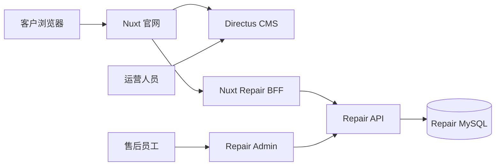

# [已废弃] Nuxt 官网与 Repair 客户门户融合实施架构

> 本文为历史方案，不再作为实施依据。现行方案见 [官网与 Repair 独立部署执行方案](./官网-Repair-独立部署执行方案.md)。当前决策是：Nuxt 官网只提供受控跳转，Repair 客户端、Repair API 和 Repair Admin 独立运行。

## 1. 决策与边界

**目标：** 客户仅访问官网域名，在 Nuxt 中完成设备选择、故障咨询、保修校验、提交报修和查看进度；维修工单、审核、维修、物流及内部管理继续由 `repairsys` 服务负责。

本方案不是把 repair 系统嵌入 iframe，也不是让 CMS 直接修改工单数据。这样可以保持统一体验，同时隔离内容运营权限与售后业务权限。



### 系统职责

| 系统 | 保留/新增职责 | 不承担的职责 |
| --- | --- | --- |
| Nuxt `website/` | 官网及客户售后界面、SSR/SEO、统一导航、CMS 内容渲染、官网域名下的 BFF | 工单状态机、售后审核、内部权限管理 |
| Directus `cms/` | 文案、图片、型号服务配置、FAQ、服务网点、服务资源、内容审核与发布 | 客户账号、保修判定、工单、附件原件 |
| Repair API `repairsys/server/` | 登录会话、设备/保修校验、报修单、工单、物流、审计、附件授权下载 | 面向客户的品牌官网页面 |
| Repair Admin | 售后专员、审核员、工程师的工作台 | 官网内容维护 |

## 2. 现有基础与改造结论

当前仓库已经有可复用基础：

- `website/` 是 Nuxt 3 官网，已有 `/service`、产品数据 BFF 与 CMS 缓存失效能力。
- `repairsys/` 已有 Express API、客户端路由、管理员端、Cookie 会话、保修校验、报修工单、附件审计和 MySQL 初始化脚本。
- `cms/` 是 Directus，已有产品型号、服务资源、服务网点、知识库、媒体资产和外部服务入口模型。
- 现有官网服务页已通过 `service-entries` 将 FAQ 的报修草稿转交给 repair。

因此不新建第二个售后后端。第一期只迁移客户前端；`repairsys/src/AdminApp.vue` 及其 API 保持运行。

## 3. 客户端信息架构

将当前服务页的设备卡片保留为入口，选中型号后把 `modelCode`、`modelName` 带入 repair 流程。

| Nuxt 路由 | 用户目的 | 主要数据来源 | 登录要求 |
| --- | --- | --- | --- |
| `/service` | 搜索故障、选择设备、浏览服务资源 | CMS、FAQ BFF | 否 |
| `/repair` | 售后门户总览，显示最近工单与服务动作 | CMS、Repair API | 可选 |
| `/repair/new` | 提交报修，预填设备、FAQ 诊断结果或保修信息 | CMS、Repair API | 是 |
| `/repair/warranty` | 校验机器号/零件号与保修资格 | Repair API | 否；提交报修时登录 |
| `/repair/requests` | 查看本人报修单和补充资料 | Repair API | 是 |
| `/repair/requests/:requestNo` | 查看单个工单的客户可见时间线 | Repair API | 是且仅工单所有人 |

`/service` 顶部搜索按意图处理：设备型号进入设备/服务入口，订单号进入 `/repair/requests`，机器号或零件号进入 `/repair/warranty`，自然语言故障进入现有 FAQ 对话。不要在浏览器端把工单号以外的敏感维修数据写入 URL。

## 4. API 与安全边界

### 4.1 推荐调用链

浏览器只调用同源 Nuxt 路径，例如：

```text
POST /api/repair/auth/login        -> Nuxt server -> Repair API /api/auth/login
POST /api/repair/warranty/check    -> Nuxt server -> Repair API /api/warranty/check
POST /api/repair/requests          -> Nuxt server -> Repair API /api/repair-requests
GET  /api/repair/requests          -> Nuxt server -> Repair API /api/repair-requests
GET  /api/repair/attachments/...   -> Nuxt server -> Repair API protected upload endpoint
```

Nuxt BFF 必须逐项白名单代理，不提供任意路径透传。它负责：请求参数校验、将当前 repair 会话 Cookie 转发到 Repair API、统一错误格式、文件大小限制、`requestId` 日志关联和针对匿名接口的限流。

不要让浏览器直接保存 CMS Token、Repair API 密钥或管理员 Cookie；不要用 Nuxt 的管理员服务账号代替客户身份调用 repair API。

### 4.2 登录方案

**一期采用 repair 既有客户账号和会话。** Nuxt 只呈现登录/注册 UI，并由 BFF 转发 `Set-Cookie`；生产环境将 Cookie 设为 `Secure`、`HttpOnly`、`SameSite=Lax`，域名限定为官网主域或明确的 repair 子域。

官网目前没有成熟的客户账户体系时，不应在融合首期强行做单点登录。后续若官网会员体系上线，再增加一次性的账号关联与 OAuth/OIDC Token Exchange；管理员账号始终与客户账号隔离。

### 4.3 附件

客户上传的铭牌、故障照片仍存放在 repair 的私有对象存储/上传目录。CMS 只保存展示用图片和资料，不保存工单附件。下载使用短时授权或 BFF 流式转发，并延续 repair 已有的附件审计。

## 5. CMS 内容模型

保留既有 `product_models`、`service_resources`、`service_locations`、`knowledge_items`。新增一个内容集合 `repair_page_configs`，以 `page_key` 区分 `repair_home`、`repair_new`、`repair_warranty` 和 `repair_progress`。

建议字段：

| 字段 | 用途 | 示例 |
| --- | --- | --- |
| `page_key` | 页面唯一标识 | `repair_home` |
| `title` / `intro` | 页面标题与说明 | 售后服务中心 |
| `hero_asset` | Banner 图片 | Directus 媒体资产 ID |
| `model_cards` | 展示型号、封面、排序、可用服务 | JSON 或关联 `product_models` |
| `action_cards` | 报修、查保修、查进度等入口文案和图标 | JSON |
| `process_steps` | 服务流程与提示 | JSON |
| `notices` / `faq_refs` | 公告、FAQ 关联 | JSON |
| `seo` | 标题、描述、分享图 | JSON |

内容记录沿用现有 `draft -> review -> published` 以及预览、缓存失效、回滚流程。发布 `repair_page_configs` 后，CMS webhook 触发 Nuxt 的缓存失效；不会触发 repair 数据变更。

业务配置不要放入 CMS：必填字段、保修规则、工单状态、可访问工单范围、维修费用和后台人员权限。若确实需要运营配置服务动作，只允许 CMS 配置有限枚举值，例如 `request`、`warranty`、`progress`，Nuxt 在服务端映射至固定路由。

## 6. 数据契约与状态

Nuxt 表单和 Repair API 之间定义单独的客户契约，避免直接依赖 `repairsys` 内部完整数据结构。

```ts
type RepairRequestCreate = {
  machineNo: string
  modelCode: string
  modelName: string
  customerName: string
  contact: string
  phone: string
  address: string
  faultDescription: string
  details: Array<{ serialNo?: string; materialName?: string; faultPhenomenon: string }>
  attachments: Array<{ uploadId: string }>
  sourceChannel: 'official_site'
  faqContext?: { conversationReference: string; errorCodes: string[]; attemptedSteps: string[] }
}
```

Repair API 新增或明确一个 `customer timeline` 输出，只暴露客户所需字段：`requestNo`、客户可读状态、下一步动作、补充材料要求、物流信息、更新时间。内部审核意见、员工姓名、完整操作日志、成本和权限字段绝不返回。

推荐客户可见状态：`待提交资料 -> 待审核 -> 审核处理中 -> 维修中 -> 待寄回 -> 已寄回 -> 已完成`。状态机继续以 Repair API 为唯一事实源；Nuxt 不自行计算状态。

## 7. 分期实施

| 阶段 | 交付内容 | 完成标准 |
| --- | --- | --- |
| P0：基础联通 | Nuxt repair BFF、健康检查、官网域名反代、Cookie 方案、接口错误与审计规范 | Nuxt 能安全调用保修校验，Repair API 不对公网开放跨域写接口 |
| P1：客户入口 | `/repair`、`/repair/warranty`、型号卡片深链、CMS `repair_page_configs`、发布与缓存失效 | 运营可修改 repair 页面图片、文案、型号顺序并在发布后生效 |
| P2：报修闭环 | `/repair/new`、登录注册、附件上传、FAQ 草稿预填、成功页 | 客户能在官网创建 repair 工单，工单来源稳定记录为 `official_site` |
| P3：自助进度 | 我的工单、详情时间线、补件、物流展示 | 客户只能读取和补充自己的工单，管理员端数据一致 |
| P4：下线旧客户端 | 301 旧 `/repair/new`、`/warranty`、`/requests` 到 Nuxt；保留 repair Admin | 连续两个发布周期无关键错误，旧 Vite 客户端不再部署 |

迁移期间，官网入口优先指向 Nuxt 新路由；旧 repair 客户端只作为回退，并通过同一个 Repair API 保持数据一致。不要双写工单或双维护两套 CMS 内容。

## 8. 代码落点

| 目录 | 改动 |
| --- | --- |
| `website/pages/repair/` | 新建门户、报修、保修、工单列表/详情页面 |
| `website/components/repair/` | 型号选择、保修表单、报修步骤、工单时间线、附件上传组件 |
| `website/server/api/repair/` | BFF 白名单路由和文件代理 |
| `website/server/services/repair-client.mjs` | Repair API 服务端客户端、超时、错误映射、Cookie 转发 |
| `website/shared/repair-contract.ts` | 浏览器与 BFF 共用的请求/响应校验类型 |
| `cms/schema/content-model.mjs` | 增加 `repair_page_configs` 及中文显示元数据 |
| `cms/extensions/content-editor-workbench/` | 增加 Repair 内容编辑表单与草稿预览入口 |
| `repairsys/server/index.js` | 只补客户时间线/上传令牌等缺少的最小 API；保留业务逻辑所有权 |
| `repairsys/src/ClientApp.vue` | P4 后停止作为对外客户端；`AdminApp.vue` 不迁移 |

## 9. 验收与运营保障

P0/P1 必测：CMS 草稿不可公开读取；发布后新标题和图片生效；CMS 不可改变业务路由；Repair API 不健康时官网显示人工服务回退；型号卡片传递的型号与报修单一致。

P2/P3 必测：未登录用户不能读写他人工单；重复提交具备幂等键；附件类型/体积受限；FAQ 转交必须获得用户同意；订单详情不泄露审核或内部数据；从 Nuxt 创建的单据在 Repair Admin 可正常审核、维修、寄回、归档。

上线指标：官网 repair 入口点击率、保修校验成功率、报修表单完成率、FAQ 转报修率、Repair API 失败率、创建工单耗时。按 `sourceChannel=official_site` 保留数据归因。

## 10. 实施前需确认的业务决策

1. 客户是否必须先登录才能校验保修，还是只在提交报修和看进度时登录。
2. 当前 repair 客户账号是否可作为官网用户的长期账号体系；若不是，单点登录另立项目。
3. Repair API 生产环境的 MySQL、对象存储、备份与域名部署方式是否已就绪。
4. 哪些工单状态可对客户显示，以及每种状态的标准解释和允许操作。

### 已确认：购机方案线索暂存 CMS

首页“获取购机方案/询价”不进入 Repair，而是通过 Nuxt BFF 写入 Directus 的私有 `leads` 集合。CMS 作为线索可靠接收层和销售跟进工作台，使用既有的去重记录、通知队列、负责人和跟进日志；后续接入 CRM 时通过异步队列同步，不能让 CRM 故障导致官网丢线索。

线索与售后数据边界固定如下：

| 数据 | 暂存/管理位置 | 后续归属 |
| --- | --- | --- |
| 购机方案、询价、合作咨询 | CMS `leads` | 销售工作台，后续可同步 CRM |
| 报修、保修、维修进度 | Repair API / Repair MySQL | Repair Admin |
| 页面文案、图片、产品资料 | CMS 内容集合 | Nuxt 官网 |

CMS 仅作为中短期线索管理层，不承担完整 CRM 的客户生命周期、销售漏斗和复杂预测报表。线索应设置私有权限、幂等去重、通知失败重试、附件私有存储、备份和保留期限。

在这些决策确认前，可以先完成 P0/P1，因为它们不改变售后工单的业务规则。

## 11. 当前采用的独立部署架构（2026-08-08）

经过验证，官网与 Repair 客户端继续合并会让登录、发布、回归和故障隔离边界变复杂。本项目采用两个独立前端、一个 Repair API 的结构：

```text
www.example.com                 Nuxt 官网
repair.example.com              Repair 客户端（repairsys/src/ClientApp.vue）
admin.repair.example.com        Repair Admin
```

- 官网服务页只负责内容展示、AI 咨询和受控跳转，不再承载 Repair 工单表单或 Repair 登录态。
- Repair 客户端通过 `build:client` / `dev:client` 独立构建和运行，直接使用 Repair API；Admin 继续使用 `build:admin`。
- 两个前端不共享 Cookie、JWT、数据库或 CMS Token。当前登录 Cookie 仅由 Repair 域维护；未来如确有统一账号需求，再引入 OAuth/OIDC，而不是跨站复制 Token。
- CMS 可以维护官网服务卡片的标题、图片和说明，但入口地址由 Nuxt 白名单映射到 `NUXT_PUBLIC_REPAIR_PORTAL_URL`，不允许 CMS 注入任意外链。
- “提交维修申请”进入 `/repair/new`；“保修状态验核”进入 `/warranty`；“维修进度查询/我的申请”进入 `/requests`。入口可附带非敏感的 `model` 查询参数，Repair 端仍需用户自行登录并确认。

## 12. Current implementation status (2026-08-08)

- Repair Admin and Repair customer client can be built independently; the standalone client no longer installs the Nuxt legacy redirect plugin.
- Nuxt `/service` maps Repair actions to a controlled standalone Repair portal URL; CMS content cannot select arbitrary destinations.
- Nuxt Repair BFF supports allowlisted proxy routes, Cookie and Origin forwarding, upstream success status forwarding, normalized errors, and same-origin attachment downloads.
- Isolated runtime verification covers registration, approved login, request creation, owner detail access, cross-account `403`, attachment upload, and same-origin download.
- JSON development storage supports `REPAIR_DB_PATH` for isolated integration tests; production continues to use Repair MySQL and private attachment storage.
- Configure `repairsysPublicBaseUrl` as the Repair root URL without `/api`; keep `repairsysApiUrl` pointed at `/api`.
- Repair API `CORS_ORIGINS` must include the production website Origin; do not replace it with a wildcard.
- Latest regression: Website `141/141`, RepairSys `26/26`, CMS `176/176`; Nuxt production build passed.
