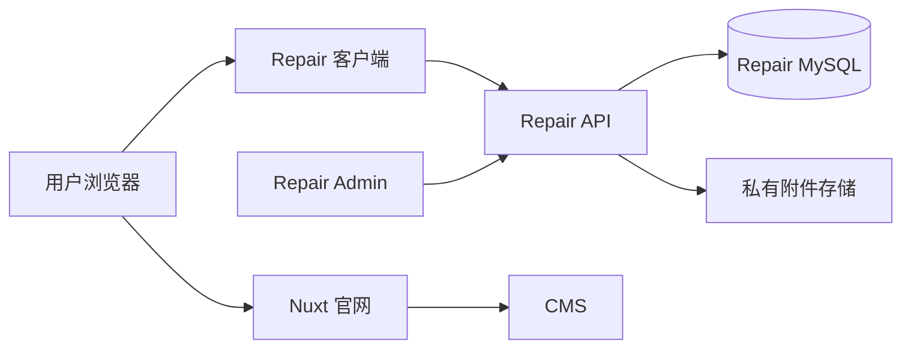

# 官网与 Repair 独立部署执行方案

**状态：现行方案**  
**版本：1.0**  
**更新时间：2026-08-08**

## 1. 决策结论

官网 Nuxt 与 Repair 客户端是两个独立应用。官网不参与维修业务过程，只提供内容展示、AI 咨询和进入 Repair 的跳转入口。



| 应用 | 生产域名 | 职责 |
| --- | --- | --- |
| Nuxt 官网 | `www.example.com` | 产品、服务说明、FAQ、AI、官网线索、Repair 入口 |
| Repair 客户端 | `repair.example.com` | 登录、报修、保修核验、维修进度、补充资料、附件 |
| Repair Admin | `admin.repair.example.com` 或内网域名 | 审核、派工、维修、物流、报表、板卡管理 |
| CMS | 内部管理域名 | 官网和服务内容发布 |

## 2. 明确边界

### Nuxt 官网负责

- 展示产品和服务内容。
- 提供 Dify AI 客服入口。
- 收集购机方案、询价等销售线索，临时存储在 CMS `leads`。
- 将用户带到 Repair 客户端，不创建、不查询、不修改 Repair 工单。
- 记录匿名入口点击量，不记录工单号、手机号等维修敏感数据。

### Repair 客户端和 API 负责

- 客户注册、登录、会话和权限。
- 维修申请、保修核验、维修进度、补充资料、附件上传。
- 板卡二维码解析、板卡与机床绑定、保修规则和状态机。
- 客户数据归属校验、审计日志和业务错误处理。

### CMS 不负责

- 工单字段校验、状态流转、保修判断、费用规则和权限。
- 生成或修改 Repair API 业务规则。
- 存储维修工单附件和客户登录 Token。

## 3. 官网到 Repair 的入口

官网只使用代码白名单生成 Repair URL，CMS 不得直接注入任意外链。

| 官网入口 | Repair 地址 | 登录要求 |
| --- | --- | --- |
| 提交维修申请 | `/repair/new` | 提交前登录 |
| 保修状态验核 | `/warranty` | 可匿名核验，按规则限流 |
| 维修进度查询 | `/requests` | 必须登录 |
| 我的维修申请 | `/requests` | 必须登录 |

入口跳转规则：

1. 官网读取 `NUXT_PUBLIC_REPAIR_PORTAL_URL`，例如 `https://repair.example.com`。
2. 只允许代码中的固定 action 映射：`repair_new`、`repair_warranty`、`repair_requests`。
3. 可附带非敏感的 `model` 参数用于预选机型；Repair 端必须重新校验，不信任 URL 参数。
4. 外部打开前显示一次离站确认，并记录匿名 `entry_type` 和来源页面。
5. Repair 不可用时，官网保留 AI/人工服务兜底，不显示内部 API 地址。

## 4. 登录与鉴权

当前阶段采用独立登录：

- Repair 客户端使用自己的 HttpOnly 会话 Cookie，例如 `repair_client_session`。
- Cookie 只发送到 `repair.example.com`，生产环境启用 `Secure`、`SameSite=Lax`。
- Nuxt 不保存 Repair Token，不转发 Repair 管理员 Cookie，也不共享数据库。
- 官网跳转不能自动把手机号、工单号或登录凭证写入 URL。

后续若确实需要统一账号，使用 OAuth/OIDC：官网和 Repair 各自建立本域 HttpOnly 会话，不能通过共享 JWT 或扩大 Cookie Domain 解决。

## 5. 板卡二维码方案

二维码只编码不可猜测的板卡标识或短期签名 token，不编码客户隐私和保修结果。

```text
https://repair.example.com/scan/<opaque-token>
```

流程：

1. Repair 前端读取二维码或允许手工输入板卡编号。
2. 调用 `GET /api/v1/boards/resolve`。
3. Repair API 校验 token、板卡状态、绑定机床和访问权限。
4. 返回 `boardId`、`modelCode`、`modelName`、绑定机床摘要和允许的下一步操作。
5. 用户确认后进入报修或保修核验，前端不得直接信任二维码里的型号名称。

管理端需要支持生成、打印、绑定、更换、作废和查询二维码；每次解析记录匿名审计事件。

## 6. CMS 内容模型

CMS 只维护展示层：

- Repair 入口卡片的标题、图片、说明和排序。
- FAQ、服务流程、寄修说明、保养说明。
- 官网服务网点、技术资料和 AI 知识库同步内容。

Repair 功能模块新增时，执行“代码模块 + CMS 内容”的双阶段发布：

1. Repair API 和客户端先实现模块及固定接口契约。
2. CMS 增加该模块的标题、图片和说明字段。
3. 通过 `module_key` 和 `enabled` 控制已开发模块是否展示。

CMS 不能凭空生成新的 Repair 功能，也不能改变 Repair API 的业务规则。

## 7. 接口和数据归属

| 数据 | 唯一事实来源 | 管理端 |
| --- | --- | --- |
| 官网产品、文章、服务文案 | CMS | Nuxt |
| 购机方案、询价线索 | CMS `leads`（临时） | CMS 销售工作台 |
| 客户账号、工单、状态 | Repair MySQL | Repair Admin |
| 板卡、序列号、绑定关系 | Repair MySQL / V8 同步数据 | Repair Admin |
| 维修附件 | Repair 私有对象存储 | Repair 客户端/Admin |
| AI 知识库 | Dify | Dify 工作流 |

Repair API 对外提供版本化客户契约，例如 `/api/v1/boards/resolve`、`/api/v1/repair-requests`。Nuxt 不再实现 Repair BFF 业务代理；保留的旧 BFF 仅用于迁移兼容，禁止新增业务依赖。

## 8. 分阶段执行

| 阶段 | 交付内容 | 验收标准 |
| --- | --- | --- |
| P0 | 独立域名、反向代理、CORS、健康检查、客户端构建 | 三个应用可独立发布和回滚 |
| P1 | 官网受控跳转、离站确认、匿名点击记录 | 三个 Repair 入口均进入正确域名，无任意 CMS 外链 |
| P2 | Repair 独立登录、报修、保修、进度和附件 | 登录态只存在 Repair 域，客户只能访问自己的工单 |
| P3 | 二维码解析、板卡绑定、自动带入报修 | 扫码后型号和板卡信息由 API 返回并可审计 |
| P4 | 视觉统一、AI 深链接、可选 OIDC | 官网与 Repair 视觉连续，AI 只在用户同意后跳转 |

## 9. 测试和发布门槛

- 官网：入口 URL 白名单、CMS 外链拒绝、离站确认、Repair 不可用兜底。
- Repair：登录、权限隔离、工单状态、附件安全、二维码 token 过期/作废。
- 集成：官网点击 → Repair 页面、扫码 → 预填 → 用户确认提交。
- 发布：Nuxt、Repair Client、Repair API、CMS 可分别构建、部署、监控和回滚。
- 安全：不在 URL、日志和 CMS 中写入密码、JWT、手机号或内部审核信息。

二维码发布额外要求：

- Repair Client 必须将 `/scan/*` 的前端路由回退到 `client.html`，不能只配置首页回退。
- Repair API 生产环境配置独立的 `BOARD_QR_SECRET`，不得把原始 token 写入数据库、日志或 CMS。
- Repair Admin 构建环境配置 `VITE_REPAIR_CLIENT_URL=https://repair.example.com`，用于生成和打印正确的扫码地址。

## 10. 当前实施优先级

当前先完成 Repair 客户端视觉统一和官网受控跳转；二维码先完成数据模型和 API 契约，再做扫描 UI。不要先把二维码逻辑塞进 Nuxt，否则会重新形成官网与 Repair 的业务耦合。

## 11. 实施状态（2026-08-10）

- P1：官网 Repair 入口采用白名单跳转，已完成。
- P2：Repair 独立登录、报修、保修、进度与附件已具备现有实现。
- P3：已完成二维码 token 签发、哈希存储、过期/作废校验、匿名解析审计、管理查询接口与 `/scan/:token` 落地页；落地页只展示板卡、物料和设备摘要，用户确认后才进入报修。
- P3：Repair Admin 已具备二维码签发、查询和作废工作台；生产环境必须配置 `VITE_REPAIR_CLIENT_URL=https://repair.example.com`，以保证打印的二维码不会指向 Admin 域名。
- P3 未完成：真实标签打印验证、移动设备相机扫描和生产 MySQL 迁移验证。
