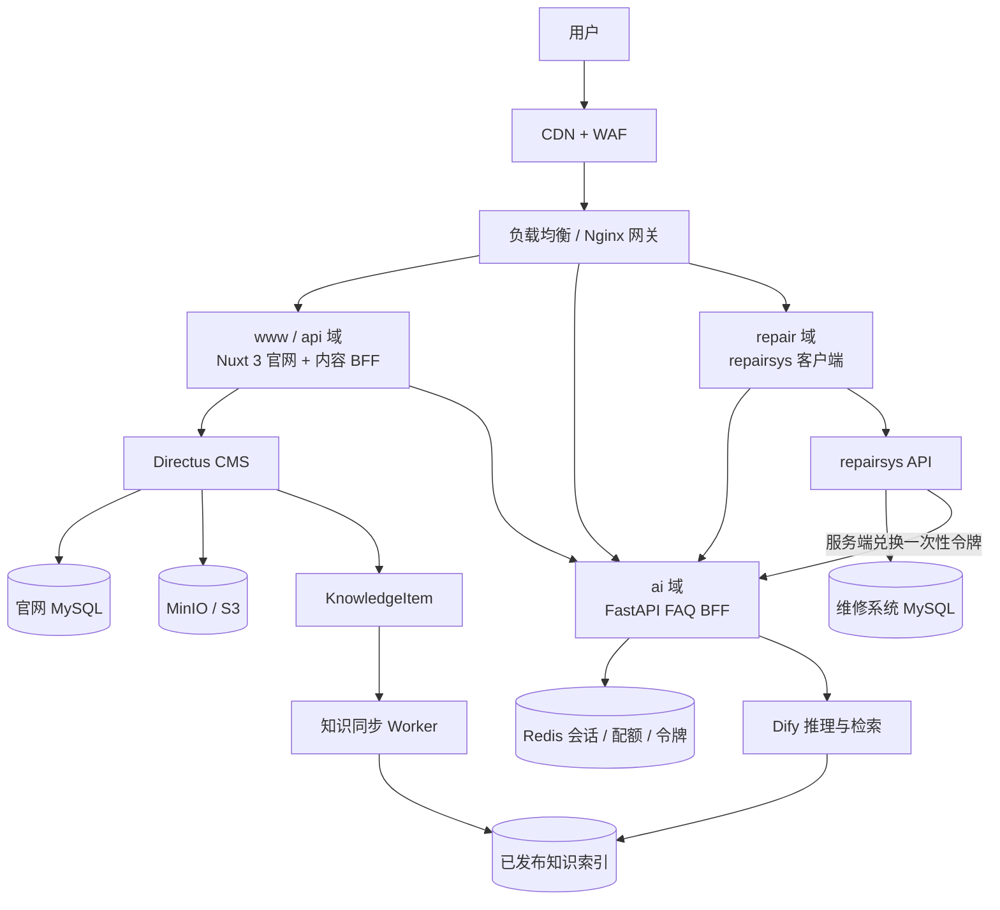

# 官网 FAQ 与维修系统目标架构

版本：v1.0  
日期：2026-08-01  
状态：已确认  
关联文档：[官网与售后系统一体化 PRD](../prd/官网与售后系统一体化PRD.md)

## 1. 架构决策

官网和 `repairsys` 共用同一个 FastAPI FAQ BFF、同一套已审核知识和同一套问答协议。官网可以覆盖公开维修 FAQ，但不承载客户维修账号、工单、保修、物流或维修结论。

边界确定如下：

1. 官网负责公开产品知识、常见故障、维护知识、报修准备和维修流程说明。
2. FAQ BFF 负责会话、配额、Dify 代理、流式响应、引用、反馈和一次性交接令牌。
3. Directus `KnowledgeItem` 是知识主数据，Dify 只是可重建的已发布知识索引。
4. `repairsys` 负责身份、设备、保修、维修申请、工单、费用和物流等确定性事实。
5. FAQ 可以解释 repairsys 返回的白名单状态，但不得自行生成工单状态、保修结果或物流信息。
6. 用户明确确认后，FAQ 才能通过五分钟内有效、兑换即失效的一次性令牌生成可编辑维修草稿；不得自动提交正式维修申请。

## 2. 目标运行拓扑



Nginx 对 FAQ SSE 路径必须关闭代理缓冲和缓存，并设置合理的连接、读取和发送超时。CDN/WAF 不得缓存、压缩合并或改写 SSE 事件流。

## 3. 官网覆盖的维修 FAQ

| 能力 | 官网 | repairsys | 数据来源 |
|---|---:|---:|---|
| 常见故障、错误码和安全排查 | 是 | 是 | 已发布 `KnowledgeItem` |
| 日常维护和易损件说明 | 是 | 是 | 已发布 `KnowledgeItem` |
| 报修前资料准备 | 是 | 是 | 已发布 `KnowledgeItem` |
| 维修、寄修和保修流程说明 | 是 | 是 | 已发布 `KnowledgeItem` |
| 技术文件和视频教学 | 是 | 是 | CMS 发布内容与对象存储 |
| 当前维修进度 | 否 | 登录后可查 | repairsys API |
| 实际保修结果 | 否 | 登录后可查 | repairsys API |
| 物流单号、费用和维修结论 | 否 | 登录后可查 | repairsys API |
| FAQ 生成维修草稿 | 用户确认后跳转 | 登录后检查、补充并提交 | FAQ 一次性令牌 + repairsys |

## 4. 知识可见性

`KnowledgeItem` 至少包含以下控制字段：

| 字段 | 作用 |
|---|---|
| `visibility` | `public`、`authenticated_customer`、`support_internal` |
| `channel` | `website`、`repair_portal`、`both` |
| `applicable_models` | 限定适用系列和型号 |
| `risk_level` | 普通、高风险、仅人工指导 |
| `publication_state` | 草稿、待审核、已发布、已下线 |
| `version` | 回答引用和知识同步版本 |
| `reviewer` / `reviewed_at` | 技术审核责任与时间 |

官网请求只能检索 `visibility=public` 且渠道允许官网使用的已发布知识。登录客户知识和内部知识不得依赖前端隐藏，必须由 FAQ BFF 和检索层共同执行服务端过滤。

## 5. 核心流程

### 5.1 公开维修问答

```text
官网打开 FAQ
-> FAQ BFF 创建或恢复 website 会话
-> Redis 校验会话、配额、并发和幂等键
-> Dify 仅检索已发布的公开知识
-> FAQ BFF 返回规范化 SSE、知识标题和版本
-> 已解决则继续官网；未解决则始终保留人工电话和直接报修入口
```

### 5.2 FAQ 转维修草稿

```text
用户确认“生成维修申请”
-> 官网调用 FAQ BFF 创建 repair_draft 交接
-> FAQ BFF 生成五分钟内有效的一次性不透明令牌
-> 官网跳转 repairsys，只在 URL 中携带随机令牌
-> repairsys 服务端使用内部密钥兑换令牌
-> repairsys 展示可编辑草稿
-> 用户补充设备、联系方式和附件后主动提交
```

URL、浏览器日志和分析事件不得包含姓名、电话、设备编号、故障描述、完整对话、附件地址或 Dify 会话 ID。令牌过期、重复兑换或 FAQ 不可用时，repairsys 返回空白草稿并保留用户已经填写的内容。

### 5.3 登录后的维修事实解释

```text
repairsys API 返回当前客户本人的白名单状态码和下一步
-> repairsys 客户端展示确定性事实
-> 可将状态码和非敏感上下文交给 FAQ BFF
-> FAQ 解释状态含义，不修改工单，不推断新事实
```

## 6. 接口边界

| 方法 | 路径 | 调用方 |
|---|---|---|
| `POST` | `/api/faq/v1/conversations` | 官网、repairsys 客户端 |
| `POST` | `/api/faq/v1/messages` | 官网、repairsys 客户端 |
| `GET` | `/api/faq/v1/quota` | 官网、repairsys 客户端 |
| `POST` | `/api/faq/v1/feedback` | 官网、repairsys 客户端 |
| `POST` | `/api/faq/v1/handoffs` | 官网、repairsys 客户端 |
| `POST` | `/api/internal/v1/faq-handoffs/{token}/redeem` | repairsys 服务端 |

浏览器不得持有 Dify API Key、FAQ 内部服务密钥或 repairsys 管理凭据。内部兑换接口只允许 repairsys 服务端通过受控内网调用。

## 7. 降级规则

| 故障 | 降级行为 |
|---|---|
| Dify 或 FAQ BFF 不可用 | 展示静态审核 FAQ、人工电话和直接报修入口 |
| Redis 不可用 | 禁止新会话和新交接，不能无状态绕过配额 |
| repairsys 不可用 | 官网保留 FAQ 和人工联系方式，禁止生成无法消费的交接 |
| CMS 不可用 | 使用最近一次有效公开缓存，草稿和下线知识不得进入 Dify |
| 一次性令牌失败 | repairsys 打开空白草稿，不覆盖用户已有输入 |

## 8. 当前实现覆盖

| 能力 | 状态 | 当前证据 | 下一步 |
|---|---|---|---|
| FastAPI FAQ BFF 协议 | partial | `faq-service/` 已有会话、SSE、配额、反馈和交接接口 | 接入真实 Redis/Dify 并生产部署 |
| repairsys 兑换交接令牌 | partial | 服务端兑换和客户端草稿恢复已实现 | 与正式 FAQ BFF 做真实端到端验证 |
| 官网 FAQ | partial | 已有全站入口和静态审核问答 | 改接 FastAPI/SSE、引用、反馈和交接确认 |
| repairsys FAQ | partial | 已有静态问答代理和可见入口 | 改接统一 FastAPI/SSE 协议 |
| CMS 知识主数据 | partial | 已有 `KnowledgeItem` 内容模型和发布规则 | 导入、审核和发布真实维修知识 |
| 知识同步 Worker | missing | 尚无正式同步运行单元 | 实现幂等发布、下线、回滚和失败重试 |
| 生产 Redis/Dify | missing | 当前仅配置和测试契约 | 准备独立环境、轮换凭据并完成容量测试 |

## 9. 实施顺序

1. **P0-1：知识治理。** 确认公开范围、高风险边界和审核责任，清洗并发布首批 `KnowledgeItem`。
2. **P0-2：FAQ 平台。** 部署 Redis、Dify、FastAPI FAQ BFF 和知识同步 Worker，完成凭据轮换和监控。
3. **P0-3：官网接入。** 将静态问答请求替换为统一会话和 SSE 协议，保留静态与人工降级。
4. **P0-4：repairsys 接入。** 将问答请求替换为统一协议，完成一次性交接、登录恢复和草稿确认。
5. **P0-5：端到端验收。** 验证公开知识过滤、引用版本、故障降级、令牌重放防护和隐私边界。
6. **P1：维修事实解释。** 仅开放 repairsys 白名单状态码解释，不把完整工单或附件发送给 Dify。

## 10. 验收标准

- 官网和 repairsys 使用相同 FAQ BFF、知识版本、引用、反馈和错误协议。
- 官网可以回答已审核的公开维修问题，但无法读取任何客户维修数据。
- 草稿、驳回、下线、过期和非公开知识不能被官网召回。
- FAQ 不生成工单状态、保修结果、费用、物流或维修结论。
- 未经用户确认不创建交接；确认后只生成可编辑草稿，不自动提交。
- 一次性令牌不超过五分钟、兑换即失效，过期和重放均失败。
- Redis、Dify、FAQ 或 repairsys 故障时仍可使用静态 FAQ、人工电话或直接报修。
- 日志和 URL 不记录故障描述、联系方式、设备编号、完整对话或 Dify 私有标识。

## 11. 尚待业务确认

- 官网公开 FAQ 的知识分类和首批发布范围。
- 高风险电气、机械和自动穿丝步骤的禁止项及审核责任人。
- 匿名会话和登录会话的保留、删除和导出政策。
- Dify 生产实例、模型供应商、并发额度和月度预算。

这些问题影响内容和生产配置，但不改变本文件已经确认的系统边界和主流程。
