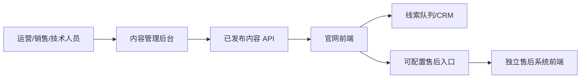

# 官网后台与售后系统接入建议

> FAQ 双端共用、知识可见性和维修草稿交接以已确认的[官网 FAQ 与维修系统目标架构](官网FAQ与维修系统目标架构.md)为准。本文件继续作为官网内容后台与 repairsys 配置化入口的边界说明。

## 结论

采用“简易内容管理后台 + 官网内容 API + 售后系统可配置超链接”的架构。官网只做品牌展示、产品内容和业务引导，售后业务完全由独立售后系统负责。

## 架构边界

### 官网内容后台负责

- 首页模块、导航、页脚和 CTA。
- 七个产品系列、机型、参数、配置、图片和 PDF。
- 加工案例、技术文章、新闻、视频和下载资料。
- 制造实力、认证、专利、企业历程和服务网点。
- 中文/英文内容、SEO、OG 图片、定时发布和历史版本。

### 售后系统负责

- 客户、联系人和设备序列号。
- 保修期限与保修状态。
- 维修工单、服务进度和维修记录。
- 售后人员、备件库存、服务评价和内部权限。

官网不直接复制售后系统数据库，也不在内容后台维护工单状态。

## 分阶段实施

### P0：官网内容可运营

- 账号登录、角色权限和操作审计。
- 草稿、审核、发布、下线、定时发布和版本回滚。
- 产品、案例、新闻视频、服务资料、网点和 SEO 内容模型。
- 媒体库支持图片、视频封面、PDF、文件大小和格式校验。
- 官网前端通过已发布 API 获取内容，并支持缓存刷新。

### P1：线索与售后外链过渡

- 询盘和图纸上传进入邮件队列或 CRM。
- “在线支持”“维修申请”“保修查询”使用后台可配置的 HTTPS 地址。
- 外链新窗口打开，标明外部系统，并保留电话、邮箱和人工支持兜底。
- 外链点击和表单提交进入统一埋点。

### P2：未来可选的统一登录或 API

- 只有在需要统一登录、官网内展示工单摘要或统一埋点时再评估。
- 使用 OAuth2/OIDC、企业 SSO 或售后系统提供的标准 API。
- 页面入口和 CTA 保持不变，升级时不重做官网页面。

## 最小内容模型

| 对象 | 关键字段 |
|---|---|
| ProductSeries | 名称、slug、场景、排序、状态、语言 |
| ProductModel | 型号、系列、定位、参数、配置、媒体、关联案例 |
| CaseStudy | 行业、材料、厚度、机型、工艺、结果、证据、授权 |
| Article/Video | 标题、封面、分类、摘要、正文/地址、发布日期 |
| ServiceResource | 类型、适用型号、文件、版本、语言、更新时间 |
| ServiceLocation | 区域、城市、企业联系方式、服务范围、状态 |
| Lead | 来源、业务类型、联系人、目标机型、工件、附件、状态 |

## 关键验收标准

- 编辑修改一个产品参数并发布后，列表、对比和详情页均显示同一版本。
- 草稿、下线内容不能通过公开 API、站内搜索或旧 URL 访问。
- 发布记录包含操作者、时间、变更内容和可恢复的旧版本。
- 技术内容和售后政策必须经过指定角色审核后才能发布。
- 售后链接失效时，页面仍能显示人工联系入口和错误说明。
- 售后入口地址可在后台修改，不需要修改网页代码。
- 图纸附件遵守格式、大小、隐私和权限规则，并有失败重试或人工兜底。

## 建议技术选择

技术选型可在原型阶段确认。优先选择支持角色权限、媒体库、版本发布、REST/GraphQL API 和自托管的 Headless CMS，例如 Directus 或 Strapi；若团队已有 CMS 或 ERP 平台，应优先评估复用而不是新增孤立后台。

售后系统接入前，先向现有供应商确认是否提供 API 文档、OAuth/OIDC、Webhook、附件上传、工单查询和沙箱环境。没有这些能力时，先做配置化外链，不要通过页面抓取或共享数据库实现“伪接口”。
