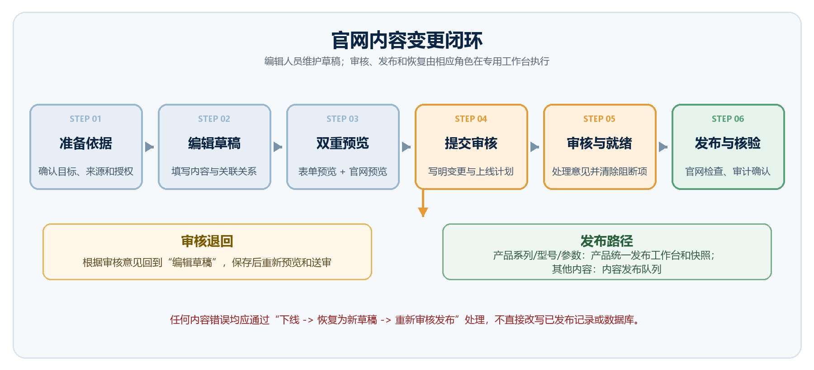
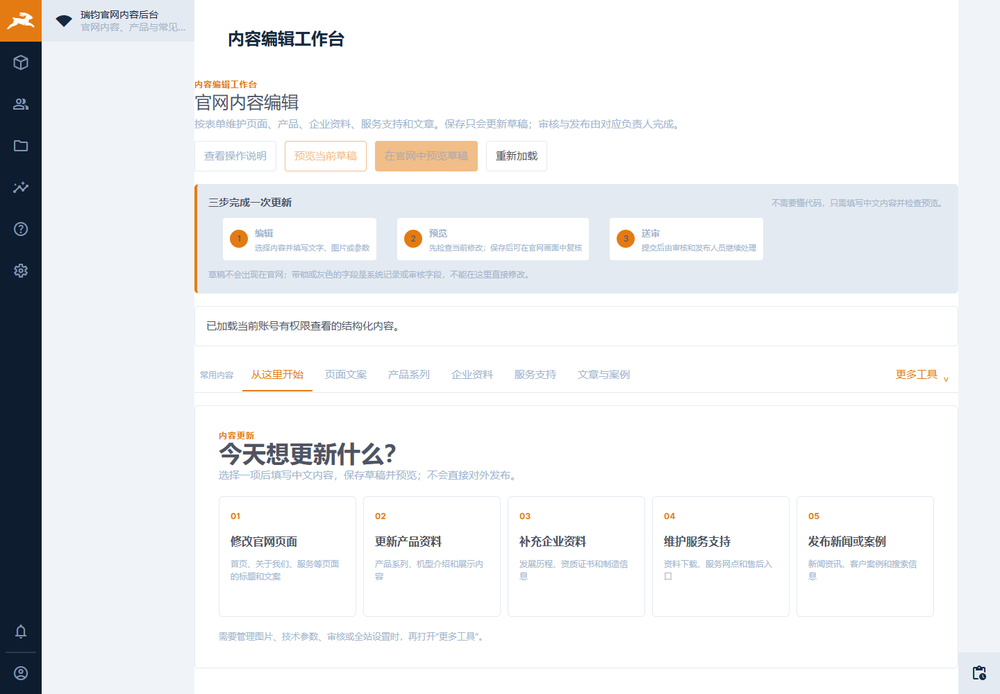
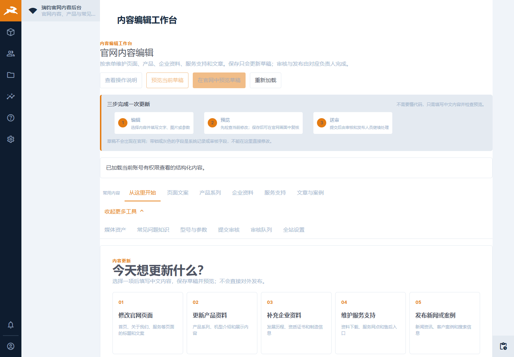
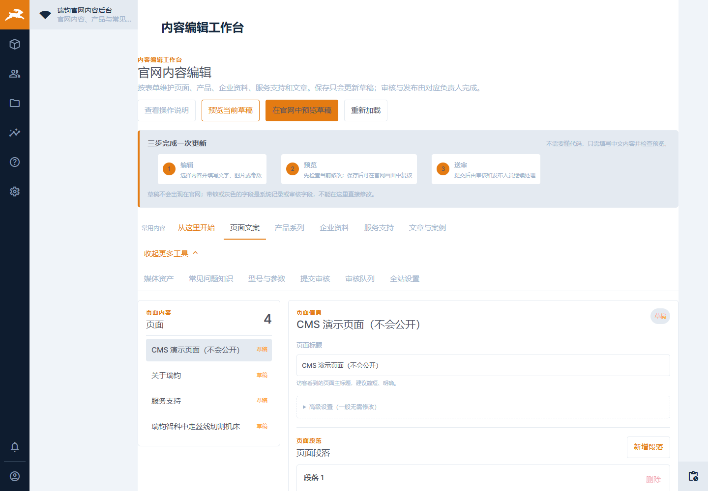

# 瑞钧官网 CMS 运营标准化流程说明书

版本：v1.0  
生效日期：2026-08-05  
适用对象：内容编辑、技术/品牌审核、发布人员、系统管理员

## 1. 目的与范围

本流程用于规范瑞钧官网 CMS 的内容编辑、审核、发布、下线、恢复与日常运维。所有官网变更均遵循：

编辑 -> 预览 -> 送审 -> 审核 -> 发布就绪检查 -> 发布 -> 发布后核验。

当前流程依据本地 Directus 演示环境编制。生产环境还需具备 MySQL、对象存储、HTTPS、备份恢复、监控和正式域名等能力后，方可执行正式上线。



*图 1：官网内容变更闭环。审核退回时回到草稿；产品内容和其他内容使用不同发布路径。*

## 2. 内容编辑工作台的日常打开方式

1. 由系统管理员确认 CMS 服务已启动。本地运行命令：

   ```powershell
   Set-Location D:\CURSORpj\gaunwang\cms
   powershell -ExecutionPolicy Bypass -File .\scripts\run-local-directus.ps1
   ```

2. 浏览器打开 `http://127.0.0.1:8055/admin/`，使用分配的个人账号登录。
3. 从后台侧栏进入“内容编辑工作台”，或直接打开：

   `http://127.0.0.1:8055/admin/ruijun-content-editor-workbench`

4. 在工作台首页选择“修改官网页面、更新产品资料、补充企业资料、维护服务支持、发布新闻或案例”。

账号密码、管理员令牌和 `.env.local` 中的密钥不得写入文档、截图、工单或源码。



*图 2：内容编辑工作台首页。日常内容更新从五个任务入口开始，固定遵循“编辑 -> 预览 -> 送审”。*

展开“更多工具”后，可进入媒体资产、常见问题知识、型号与参数、提交审核、审核队列和全站设置。



*图 3：更多工具用于处理媒体、审核与全站设置等辅助任务。*

## 3. 标准变更流程

### 3.1 准备

- 明确变更目标、内容责任人、上线窗口和来源依据。
- 确认产品参数、宣传主张、客户授权、服务信息等内容已由相应业务负责人提供。
- 准备可公开使用的媒体素材和授权说明。

### 3.2 草稿编辑

- 在“常用内容”中选择业务类型，填写标题、正文、摘要、分类、SEO、来源和关联关系。
- 保存只会更新草稿，不会对外发布。
- 已进入审核、排期或发布状态的内容不可直接改写，需要按版本流程恢复为草稿。



*图 4：页面文案编辑示例。左侧选择草稿，右侧编辑访客可见内容并保存草稿。*

### 3.3 受控媒体

1. 在“更多工具 -> 媒体资产”上传候选文件。
2. 填写使用范围、替代文本、版权状态和授权/来源说明。
3. 由技术或品牌审核人员审核，再由发布人员发布素材。
4. 仅从受控选择器引用已发布素材；禁止直接填写文件 ID、使用本地路径或临时外链。

### 3.4 预览与送审

1. 点击“预览当前草稿”检查未保存表单中的文字和字段。
2. 保存后点击“在官网中预览草稿”，检查官网真实版式、图片、链接、CTA 和移动端阅读效果。
3. 在“提交审核”填写变更说明、依据、影响范围和计划上线时间。
4. 审核退回后，修订草稿并重新预览、送审。

### 3.5 发布

- 发布人员先在“发布前就绪检查”清除全部阻断项。
- 非产品内容通过“内容发布队列”执行发布、下线和归档。
- 产品系列、型号和参数必须通过“产品统一发布工作台”发布为同一产品快照。
- 发布后必须在官网核验公开页面和审计记录。

## 4. 角色边界

| 角色 | 职责 | 边界 |
| --- | --- | --- |
| 内容编辑 | 草稿编辑、预览、送审 | 不直接发布，不绕过媒体审核 |
| 技术审核 | 参数、服务资料、FAQ 和技术主张审核 | 不代替发布人员发布 |
| 品牌/业务审核 | 品牌表达、版权、客户授权与宣传主张审核 | 不修改技术结论 |
| 发布人员 | 就绪检查、发布、下线、归档与核验 | 不在状态流转时改写内容字段 |
| 系统管理员 | 权限、健康检查和维护窗口管理 | 不代替业务审核结论 |

## 5. 发布后与异常处置

- 发布后核验官网页面、关联页面、链接、CTA、媒体、SEO 和版本审计。
- 内容错误：立即下线，按内容版本恢复为新的未发布草稿，修订后重新审核发布。
- CMS 不可访问：停止编辑并记录错误，系统管理员运行 `npm run runtime:verify`。
- 媒体授权问题：停止引用并下线受影响内容，重新走候选、审核、发布流程。
- 官网仍显示旧内容：确认 CMS 已发布状态与官网缓存失效状态，不重复发布碰运气。

## 6. 周期运维

- 每次发布：预览、就绪检查、发布后官网核验、审计确认。
- 每日：查看运营总览中的草稿、待审核、已发布和待处理数量。
- 每周：清理和跟进媒体候选、待审核内容、下线记录、服务资料版本和外链状态。
- 每月：复核账号权限、恢复记录、缓存异常、备份恢复演练状态。

完整排版版见 `output/瑞钧官网CMS运营标准化流程说明书_v1.0.docx`。
