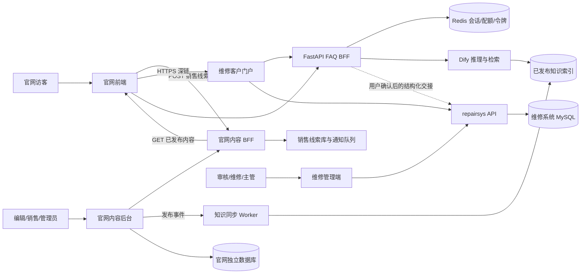
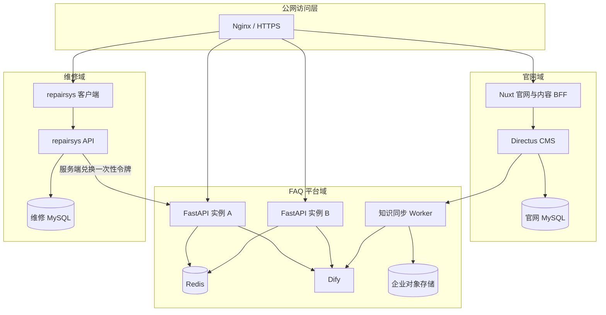
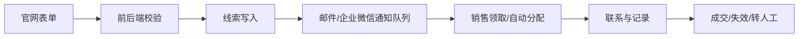
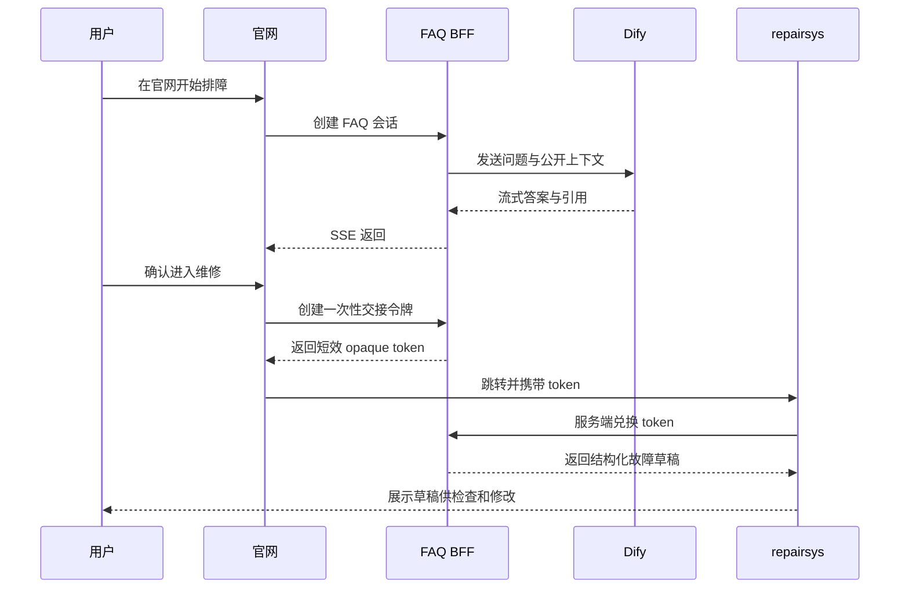
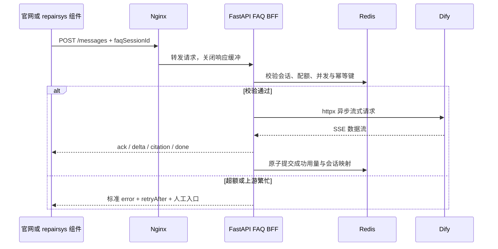

# 瑞钧智科官网、内容后台、FAQ AI 与售后系统一体化 PRD

版本：v0.59（确认官网、FAQ 与维修系统目标架构；补齐内容版本、公共媒体审核、官网页面媒体解析、repairsys 首包与安全加固、FAQ 来源防护、会话主动失效、维修附件内容校验、官网与维修端 FAQ 的可配置流式接入、会话接续、知识引用、反馈、局部无障碍支持、Windows 本地 CMS 运行基线、FAQ 内部交接路由一致性、跨系统本地回归基线、知识主数据治理字段、FAQ 归档草稿导入、技术审核安全门槛、只读审核清单、服务资料与产品型号检索、销售线索与通知异常工作台、首页机台过渡生命周期、关于页连续开场叙事、全站 Header 生命周期、FAQ 跨路由开屏可见性、人工服务兜底、全站键盘焦点管理、售后入口草稿联调、健康门槛、首次离站确认、匿名点击持久化、只读后台权限与归因聚合模块、本地运行自检、产品与服务内容审核清单、产品审核后台模块、最小权限审核读取账号、本地审核账号初始化、服务支持审核后台模块、文章详情公开 API、文章详情页、发布就绪规则）  
日期：2026-08-01  
状态：FAQ 架构与交接流程已确认；其余业务问题待评审  
官网依据：当前 `demo/`、现有设计文档与 QA 记录  
售后依据：[`3gU11/repairsys`](https://github.com/3gU11/repairsys) `main@61e830f9de9c7f2bd963a8f54ae31d5b8156f43a`  
FAQ 依据：`FAQ/Dify知识库.zip` 与 `FAQ/rj-ai_SdNdm.tar.gz`  
本次更新：官网和 repairsys 客户端均已具备可配置的浏览器侧 FAQ BFF 接入。未配置 `NUXT_PUBLIC_FAQ_BFF_URL` 或 `VITE_FAQ_BFF_PUBLIC_URL` 时继续使用静态审核 FAQ；配置合法公开 HTTP(S) 地址后，浏览器以 Cookie 调用统一的会话、SSE、引用和反馈协议。官网交接到维修系统的会话 ID 只保存在当前标签页，且仅作为请求体中的不透明引用，不进入 URL 或故障表单。真实 FastAPI/Redis/Dify、跨域 Cookie/SSE 与交接端到端验证仍待 Linux 虚拟机与 Docker 环境就绪后继续。

实施快照（2026-08-01，v0.25）：repairsys 新增独立 FAQ BFF 协议客户端。维修端会优先恢复官网一次性交接得到的有效会话 ID，使用 `repair_portal` 来源创建或恢复会话，按 SSE `ack`、`delta`、`citation`、`error`、`done` 事件渲染答案、知识标题/版本和反馈；“有帮助/需要人工协助”只在获得有效答复引用后出现。BFF 失效时不影响原有静态 FAQ 与直接报修路径。新增协议测试后 repairsys 自动化测试为 `19/19`，客户端与后台生产构建均通过；这只验证浏览器协议和降级路径，不替代真实 BFF、Redis、Dify 或跨域凭据端到端测试。

实施快照（2026-08-01，v0.26）：Windows 本地 CMS 的 C++ 构建前置已补齐 `Microsoft.VisualStudio.Component.VC.Llvm.ClangToolset`，并使用项目级 Node `v22.23.2` 对 `sqlite3` 和 `isolated-vm` 源码重建成功。Node 22 下原生模块加载验证通过，CMS 自动化测试为 `78/78`，以 `.env.local` 仅注入当前进程启动的 Directus 已通过 `GET http://127.0.0.1:8055/server/health` 的 `200` 健康检查。该项只代表 Windows 本地开发运行基线；Docker/Linux、Redis、Dify、生产 MySQL/对象存储、HTTPS 和生产发布验证仍未完成。

实施快照（2026-08-01，v0.27）：修复 repairsys 服务端兑换 FAQ 一次性交接令牌时的内部 URL，与 FastAPI 的唯一内部契约统一为 `POST /api/internal/v1/faq-handoffs/{token}/redeem`。内部密钥仍仅在 repairsys 服务端请求头传递，浏览器不接触内部地址或凭据；令牌过期、重复兑换和上游不可用继续映射为可安全降级的维修端错误。新增定向契约测试后 repairsys 自动化测试为 `21/21`，客户端和后台生产构建均通过。真实 FastAPI/Redis/Dify 部署后的跨进程兑换与官网到维修端端到端验证仍待 Linux/Docker 环境，不以该模拟 HTTP 契约替代。

验证快照（2026-08-01，v0.28）：在当前 Windows 本地环境完成跨系统回归。官网 Nuxt 自动化测试 `81/81` 与隔离生产构建通过；FAQ FastAPI 协议测试 `6/6` 通过；CMS Node 22 自动化测试 `78/78` 通过且 Directus 健康检查为 `200`；repairsys 自动化测试 `21/21`、客户端和后台生产构建通过。构建期间仅出现第三方 `@vueuse/core` 的 Rollup 注释警告，不影响产物生成。本快照不覆盖真实 Redis/Dify、跨域 Cookie/SSE、正式 MySQL/对象存储、HTTPS、Docker/Linux、容量压测、生产部署和真实设备验收。

实施快照（2026-08-01，v0.29）：CMS `knowledge_items` 已补齐稳定且唯一的 `source_key`、服务端可强制执行的 `visibility` 和 `channel` 字段，并保留既有风险等级、版本、技术审核与 Dify 同步状态字段。集合默认仍为 `draft/unpublished`，因此该变更不会使 FAQ 知识自动公开或进入 Dify。新增内容模型契约测试后 CMS 自动化测试为 `79/79`；本地 Directus schema 幂等应用结果为新增 3 个字段、更新 2 个受控字段。下一步才是将归档 CSV 清洗为可审核草稿、补齐风险边界和来源证据；Dify 索引同步仍等待 Linux/Docker 环境与 DSL/凭据确认。

实施快照（2026-08-01，v0.30）：已从 `FAQ/Dify知识库.zip` 的 6 个 CSV 导入 235 条 `knowledge_items` 内部待审草稿。每条记录使用“归档相对路径 + 源记录序号”生成稳定 `source_key`，首次真实导入结果为 `created=235`；再次导入结果为 `created=0, updated=235, skippedReviewed=0`。导入器只更新既有 `draft/unpublished` 记录，审核或发布中的记录会跳过；为此补齐了系统管理员更新普通草稿字段时保留既有生命周期的服务端工作流，未放宽显式审核、发布、下线或归档的状态机。真实数据库复核为 `total=235`、`published=0`、`notDraft=0`、`notInternal=0`、`syncEligible=0`，CMS 自动化测试为 `83/83`。这些记录尚未完成技术审核、风险边界和对外可见性确认，未公开、未进入 Dify、未上传图片，也不能视为真实 Dify/Redis/Linux/Docker 或生产端到端验证完成。

实施快照（2026-08-01，v0.31）：`knowledge_items` 新增 `safety_preconditions` 和 `escalation_guidance`，并由服务端发布工作流强制执行知识审核就绪校验：草稿可继续编辑；进入 `review` 或 `scheduled` 前必须有来源键/文档、分类、标题、排障步骤、风险等级、版本、技术审核责任人、可见范围和渠道；`risk_level=high` 还必须包含明确安全前置条件与人工升级说明；只有 `visibility=public` 的已排期知识才能发布。权限不足或非法状态转移仍优先返回原有状态机错误，避免暴露缺失字段。实际 schema 幂等应用新增 2 个字段；真实 Directus 回归中，对一条导入草稿送审返回 `400`，该记录保持 `draft/unpublished`。复核后 235 条记录仍全部为内部草稿，CMS 自动化测试为 `87/87`。这项实现只防止不完整或高风险知识进入审核/公开，不替代技术团队逐条填写、风险判定、审核责任人指定、可见范围确认或 Dify 索引同步。

实施快照（2026-08-01，v0.32）：新增只读 `npm run report:knowledge-review` 审核清单导出器；它以 CMS 临时管理员会话读取私有 `knowledge_items`，按风险优先级列出来源、当前状态、渠道、可见范围、版本、审核责任人、排障步骤和送审前待补项，全程不写入 CMS、不变更状态、不触发 Dify 同步。真实本地导出包含 235 条记录，其中导入时的保守默认分类为高风险 208 条、中风险 27 条、低风险 0 条；这只是归档导入的初始分类，必须由售后技术人员逐条复核，不能作为正式风险判断或公开依据。新增报告与治理测试后 CMS 自动化测试为 `88/88`。真实 Dify/Redis/Linux/Docker、知识同步 Worker、技术审核结论与公开发布仍未完成。

实施快照（2026-08-01，v0.33）：官网新增公开路由 `/resources`，并在默认主导航提供“资料与网点”入口。该页只调用同源 `GET /api/public/v1/service-resources` 与 `GET /api/public/v1/service-locations`，由既有 Nuxt BFF 继续只返回已发布服务资料和有效网点；浏览器中的型号输入仅规范化匹配已返回的 `applicable_models`，不会读取 CMS、提交查询、保存输入或暴露草稿。无已发布资料或无匹配型号时显示人工服务空状态。新增筛选器与页面契约测试后官网自动化测试为 `84/84`，隔离 Nuxt 生产构建通过；真实浏览器已验证 `/resources` 桌面导航、移动端无背景遮挡和筛选输入。当前本地 CMS 服务资料仍未发布，因此页面空状态属于预期，不代表资料或网点审核、正式 AI 接口、Dify/Redis/Linux/Docker 或生产发布完成。

实施快照（2026-08-01，v0.34）：CMS 新增 Directus 私有模块“销售线索”。它只使用当前登录账号的 Directus 会话读取 `/items/leads`，因而继续受既有 `sales_user` 权限过滤约束，只能看到未领取线索和本人线索；不使用浏览器侧服务账号、管理员令牌或 CRM 凭据。销售人员可在工作台领取新线索、填写跟进记录、开始跟进，并将跟进中的线索标记为已转化、无效、重复或垃圾线索。每次写入仍进入既有服务端 `lead-workflow` 状态机，负责人和 `activity_log` 都由服务器生成，客户端传入的伪造审计字段会被覆盖；系统管理员通过同一路径操作也不再绕过此审计状态机。新增模块与管理员审计契约测试后 CMS 自动化测试为 `90/90`，模块已使用项目 Node 22 编译通过。当前已运行的本地 Directus 进程需要重启后才会发现新模块；本次未重启现有进程，未创建演示线索，也不代表负责人分配规则、通知渠道、CRM 同步、正式审计策略、生产 MySQL 或生产部署已完成。

实施快照（2026-08-01，v0.35）：CMS 新增 Directus 私有模块“通知异常处理”。它只使用当前登录账号的 Directus 会话查询 `status=manual_review` 的 `/items/lead_notification_jobs`，仍由既有 `notification_manager` 权限控制；销售角色不能借该界面读取或处理通知队列。通知管理员必须填写不超过 500 字的人工处理说明，才可将失败任务重新投递、标记为已人工通知或标记解决；写入继续由服务器 `notification-workflow` 校验状态、追加办理人和审计记录，客户端不能直接修改锁、尝试次数或审计数据。新增模块契约测试后 CMS 自动化测试为 `91/91`，模块已使用项目 Node 22 编译通过。现有 Directus 进程需重启后才会发现该模块；本次未创建通知任务、未调用外部 Webhook，也不代表企业微信/邮件/CRM 渠道、负责人分配、生产 MySQL 或生产部署已配置完成。

实施快照（2026-08-01，v0.36）：官网产品中心新增“按型号检索”。页面额外读取同源 `GET /api/public/v1/products`，该 BFF 已以服务器端权限查询并二次过滤为已发布、当前有效的型号；浏览器仅对已返回的 `model_code`、名称和系列执行 Unicode 规范化本地匹配，不向 CMS 提交搜索词、不保存输入，也不返回草稿。每个结果链接至已发布型号详情；型号缺少详情 slug 时才回退到对应系列列表。输入为空时仅显示有效公开型号，缺失型号编码或畸形记录不会渲染；无匹配或无已发布型号时显示人工选型空状态。新增筛选器与页面契约测试后官网自动化测试为 `86/86`，隔离 Nuxt 生产构建通过；真实浏览器已验证 `/product` 桌面与 390px 移动端布局和 `FR400XS` 无匹配提示。当前本地 CMS 尚无已发布型号，因此未能对真实结果卡和详情链接做端到端验证；产品参数、资料和系列名称仍须完成业务技术审核后发布。

实施快照（2026-08-01，v0.37）：Nuxt 首页新增首屏机台至“三个理由”引导页的连续滚动生命周期。桌面端且用户未请求减少动效时，GSAP `ScrollTrigger` 固定引导页并按滚动进度让机台缩小、位移，标题和三条理由按顺序进入；随后的三理由画面仍使用既有固定滚动覆盖。移动端和减少动效场景不固定页面，保持机台、标题和全部理由的自然文档流与可读性；理由标题继续优先使用已发布页面段落的安全回退解析。新增纯进度映射与 Nuxt 页面契约测试后官网自动化测试为 `88/88`，隔离 Nuxt 生产构建通过；真实浏览器已验证桌面滚动、390px 移动端布局和零控制台错误。该项只迁移首页的一段连续过渡，尚未迁移 Demo 中其余沉浸式面板、完整导航生命周期或正式流量切换，也不代表宣传数字、媒体授权和 CMS 审核完成。

实施快照（2026-08-01，v0.38）：Nuxt “关于我们”页将首屏机台和 “Since 1997” 合并为同一条桌面端连续开场叙事。桌面端且用户未请求减少动效时，页面复用已导出的横幅背景，由 GSAP `ScrollTrigger` 按滚动进度驱动背景的微小位移、缩放和旋转，并使首屏标题轻微上移淡出后衔接创始年份画面；不读取或改写 CMS 内容。`901–1100px` 窄桌面额外收紧标题缩进以保持两行信息层级。移动端和减少动效场景继续保留原有机台图片及自然文档流。新增进度映射与 Nuxt 页面契约测试后官网自动化测试为 `90/90`，隔离 Nuxt 生产构建通过；真实浏览器已验证窄桌面滚动、`390×844` 移动端布局与零控制台错误。完整关于页沉浸式面板迁移、正式流量切换，以及宣传文案和媒体授权审核仍未完成。

实施快照（2026-08-01，v0.39）：Nuxt 全站 Header 新增首屏生命周期。桌面端 Header 在每个页面的首个视觉段落内保持收束、半透明形态；滚动越过该段落底部后平滑展开为全宽导航。阈值由首段的真实位置和高度减去 Header 高度计算，无法测量时保守保持收束；移动端继续使用普通全宽导航，减少动态效果时关闭过渡。为保障关于页长开场中的 Header 可黏附显示，移除了页面根容器的溢出截断，内部视觉段落仍各自限制内容溢出。新增状态映射和 Nuxt 组件契约测试后官网自动化测试为 `93/93`；真实浏览器已验证首页收束/展开、关于页长开场收束并在后续内容展开、`390×844` 移动端与零控制台错误。该项只迁移导航生命周期，不替代完整页面沉浸式迁移、正式内容审核或生产切流。

实施快照（2026-08-01，v0.40）：官网全站 FAQ 浮窗补齐跨路由状态管理与人工服务兜底。用户从任意子页面回到首页时，浮窗会关闭并重新等待首页开屏视频完成事件，避免在视频播放期间过早遮挡画面；离开首页后 FAQ 仍可直接使用。对话窗口始终提供站内“查看服务支持”入口和 `150 5016 6844` 电话链接，因此未配置 FAQ BFF、AI 无法回答或服务暂不可用时，用户仍有确定的人工与服务页路径。新增纯状态映射和组件契约测试后官网自动化测试为 `95/95`，隔离 Nuxt 生产构建通过；真实浏览器已验证关于页打开 FAQ 后的服务入口、返回首页开屏期间浮窗隐藏，以及零控制台错误。此实现不等同于真实 FastAPI FAQ BFF、Redis/Dify、跨域 Cookie/SSE 或官网到 repairsys 的生产交接，相关 Linux/Docker 工作仍按计划暂缓。

实施快照（2026-08-01，v0.41）：官网全站 FAQ 浮窗补齐键盘焦点管理。用户打开对话框后，焦点会在下一个渲染周期自动落到问题输入框；点击关闭、遮罩关闭或按 `Escape` 关闭后，焦点回到触发浮窗的“AI 服务”按钮，避免键盘用户在 Teleport 对话框卸载后失去操作位置。新增组件契约测试后官网自动化测试为 `96/96`，隔离 Nuxt 生产构建通过；真实浏览器已验证打开后的输入框焦点、`Escape` 后触发按钮焦点与零控制台错误。该项仅完善现有静态 FAQ 前端的键盘可用性，不替代真实 FastAPI FAQ BFF、Redis/Dify、跨域 Cookie/SSE 或官网到 repairsys 的生产交接，相关 Linux/Docker 工作仍按计划暂缓。

实施快照（2026-08-01，v0.42）：服务页“瑞钧 AI 服务助手”补齐与全站 FAQ 一致的键盘焦点闭环。对话框打开时会记录实际触发入口并在下一个渲染周期聚焦问题输入框；任何来源的对话框关闭，包括关闭按钮、遮罩和 `Escape`，都会恢复到原入口，因此首页服务咨询、AI 服务台和四条预置问题均保持可预测的键盘返回位置。新增服务页组件契约测试后官网自动化测试为 `97/97`，隔离 Nuxt 生产构建通过；真实浏览器已验证从“报修前需要准备哪些资料？”打开、输入框焦点、`Escape` 后返回该问题按钮与零控制台错误。该项只完善服务页静态 FAQ 前端可访问性，不替代真实 FastAPI FAQ BFF、Redis/Dify、跨域 Cookie/SSE 或官网到 repairsys 的生产交接，相关 Linux/Docker 工作仍按计划暂缓。

实施快照（2026-08-01，v0.43）：服务页新增常驻的“人工售后支持”兜底条，使用同源公开服务配置中的 `supportPhone` 生成电话链接；号码先归一化为 7 至 16 位数字，不满足条件时回退至已确认的 `15050166844`，因此异常 CMS 值不会进入 `tel:` 协议。该入口不依赖 FAQ BFF、Dify 或维修系统健康状态，可在 AI 助手之外直接拨打人工支持。新增页面契约测试后官网自动化测试保持 `97/97`，隔离 Nuxt 生产构建通过；真实浏览器已验证“需要人工协助？”及 `tel:15050166844` 链接可见、零控制台错误。该项仅完善官网前端有界降级，不替代真实 FastAPI FAQ BFF、Redis/Dify、跨域 Cookie/SSE、CMS 正式内容审核或官网到 repairsys 的生产交接，相关 Linux/Docker 工作仍按计划暂缓。

实施快照（2026-08-01，v0.44）：完成本地售后入口 CMS 草稿联调。既有种子器通过 `entry_type` 稳定更新了 `support`、`request`、`warranty`、`requests` 四条记录，目标为本机 repairsys 的 `/support`、`/repair/new`、`/warranty`、`/requests` 路径；管理端复核结果均为 `enabled=false`、`status=draft`、`publication_state=unpublished`。官网 BFF 服务账号尝试写入时收到 `403`，证明其仅能读取已发布内容、不能越权修改 CMS；随后仅以本地 Directus 管理员会话完成草稿更新。官网公开 `GET /api/public/v1/service-entries` 复核仍返回空 `entries`，未泄露本机链接。CMS 自动化测试 `91/91` 通过。正式域名、入口负责人和人工兜底确认前不得启用或发布这些记录；真实 FastAPI FAQ BFF、Redis/Dify、跨域 Cookie/SSE、生产 repairsys 和 Linux/Docker 部署仍按计划暂缓。

实施快照（2026-08-01，v0.45）：官网服务页将 repairsys 健康探针作为外部入口的硬性门槛。共享规则仅在公开服务配置的 `available === true` 时允许解析 `support`、`request`、`warranty`、`requests` URL；`false`、缺失值或字符串值均不生成链接，服务页保留独立的人工电话兜底。新增健康状态单元测试和页面契约测试后官网自动化测试为 `98/98`，隔离 Nuxt 生产构建通过；本地 repairsys 健康检查为 `true` 时浏览器复验服务页人工电话和零控制台错误。当前 CMS 入口仍全部处于草稿，故公开页面不会显示或尝试打开本机链接。此项满足健康失败时有界降级，不替代正式域名确认、入口发布审核、外部跳转确认、匿名点击归因、真实 FastAPI FAQ BFF、Redis/Dify 或 Linux/Docker 生产部署。

实施快照（2026-08-01，v0.46）：官网服务页新增当前浏览器会话内首次离站确认层，提示“即将进入瑞钧售后服务系统”；确认后以 `noopener,noreferrer` 新标签打开，原官网保持不变。事件输入先在浏览器侧收敛为 `entryType` 与无查询串/片段的 `sourcePath`，服务端再次校验；新增私有 CMS `service_entry_clicks` 模型，官网 BFF 仅有创建权限且写入体仅含 `entry_type`、`source_page`，不读取、不写入姓名、电话、机床号、故障文字或目标 URL。当前本地 CMS 尚未应用该集合且未配置 `CMS_SERVICE_ENTRY_CLICKS_URL`，公开接口会安全返回 `accepted=false, stored=false`，不会伪造已持久化归因；售后入口也仍均为未发布草稿，故没有为演示打开本机 repairsys 链接。官网自动化测试为 `102/102`，CMS 自动化测试为 `92/92`，隔离 Nuxt 生产构建通过；浏览器复验 `/service` 为 `200`、AI 静态指引可打开，合法匿名事件返回未存储状态、带查询参数事件被 `400` 拒绝。后续需在维护窗口应用 CMS schema、为 BFF 配置私有集合 URL、重启官网进程加载配置，并在正式域名及入口审核通过后才可验证真实持久化和新标签跳转。

实施快照（2026-08-01，v0.47）：已在本地 Directus 幂等应用 `service_entry_clicks` 私有集合，结果为新增 `1` 个集合、`12` 个字段和官网 BFF 的 `1` 条仅创建权限；本地 BFF 配置脚本现同时写入 `CMS_SERVICE_ENTRY_CLICKS_URL` 与 Nuxt 对应变量，后续重新配置 BFF 不会丢失该端点。通过加载该私有配置的隔离 Nuxt 实例，真实 `POST /api/public/v1/service-entry-clicks` 返回 `accepted=true, stored=true`；管理员会话只核对 `entry_type=request`、`source_page=/service-e2e-v046` 后立即删除验证记录。带查询参数来源路径返回 `400`，官网 BFF 服务账号读取该集合返回 `403`，证明其只能创建不能读取。CMS 自动化测试 `92/92`、官网自动化测试 `102/102`、隔离 Nuxt 生产构建均通过。现有 `4303` 开发进程为避免中断未重启，仍需在下次维护窗口重载才会使用新本地配置；四个 repairsys 入口继续保持草稿/未发布，正式域名、入口发布审核、生产分析看板、HTTPS 与生产部署仍未完成。

实施快照（2026-08-01，v0.48）：修正 `read_only_manager` 的角色计划与 Directus 策略白名单不一致问题。只读管理员现在可在 Directus 原生集合界面查看私有 `service_entry_clicks`，但无创建、更新或删除权限；官网 BFF 仍仅可创建，二者不共享权限。新增权限契约测试后 CMS 自动化测试为 `93/93`。本地 schema 幂等应用未创建集合或字段，只新增 `1` 条策略权限；管理员复核该记录为 `action=read`、`fields=["*"]`、单条匹配。该集合当前用于原始匿名入口归因浏览，尚未提供生产聚合看板、数据保留策略、正式域名指标或跨环境监控，且不改变四类售后入口的草稿/未发布状态。

实施快照（2026-08-01，v0.49）：CMS 新增私有 Directus 模块“售后入口归因”。模块只使用当前登录会话向 `service_entry_clicks` 发起按 `entry_type`、`source_page` 分组的 `count(*)` 聚合读取，页面显示总点击、入口类型数、来源页面数和排序明细；不拉取原始点击行、不展示客户、设备、问题文字或 URL 查询内容，也不含 BFF、管理员或 worker 凭据。只读管理员与系统管理员可沿用已有读取权限访问，模块没有写操作。新增模块契约测试和 Directus 扩展构建均通过；当前运行中的本地 Directus 为避免中断尚未重启，重载后才会发现该模块。生产聚合指标定义、保留/删除策略、告警、跨环境监控和正式域名数据仍待评审。

实施快照（2026-08-01，v0.50）：CMS 新增只读本地运行自检 `npm run runtime:verify`，固定以项目 Node 22 检查 `sqlite3`、`isolated-vm`、本机 Directus 健康检查及具有 Directus 扩展清单的构建产物。自检仅允许本机回环 HTTP 地址，不读取或输出 `.env.local` 密钥，不写入数据，也不启动、停止或重启 Directus；空的历史目录不会被误报为未构建扩展。当前验证结果为 Node `22.23.2`、两项原生模块成功加载、`GET /server/health=200`、8 个实际扩展均已构建；CMS 全量自动化测试为 `98/98`。扩展构建完成不等同于运行中 Directus 已加载，新归因模块仍需在维护窗口重启后才会被发现；这不替代生产 MySQL、对象存储、备份、HTTPS、Linux/Docker、Dify/Redis 或正式部署验收。

实施快照（2026-08-01，v0.51）：CMS 新增 `npm run report:product-review`，只读汇总 `product_series` 和 `product_models` 的来源、草稿状态、系列归属、参数冲突、观察到的型号名称、待确认别名与参数完整性。它不读产品媒体、线索或 FAQ，不写入 CMS、不改变审核状态、不刷新官网缓存，也不公开任何产品；输出保留来源中的全角型号名称，便于人工对照原始文件。定向契约测试覆盖冲突优先级、缺失证据及受限读取，CMS 全量自动化测试为 `101/101`。使用一次性本地管理员会话的真实导出得到 7 个系列、29 个型号、8 条系列归属待确认、3 条参数冲突和 2 条待确认系列别名；所有记录仍为 `draft/unpublished`。该清单帮助产品负责人和技术审核人完成审核，不替代在售范围、型号命名、参数版本、测试条件、媒体授权和正式发布的人工确认；生产环境应使用最小权限的专用审核读取令牌，而非本地管理员会话。

实施快照（2026-08-01，v0.52）：CMS 新增 `npm run report:service-content-review`，只读汇总 `service_resources`、`service_locations` 和 `external_service_entries` 的受控文件、版本、网点服务状态、联系方式完整性和售后入口发布条件。报告不会输出具体联系方式或入口域名，只显示入口类型、目标路径和审核状态；不读取线索、FAQ、客户或 repairsys 数据，不写入 CMS、不刷新官网缓存，也不打开外部系统。定向契约测试覆盖三集合受限读取、未上传资料、网点缺项、未确认健康状态和本机暂存入口；CMS 全量自动化测试为 `103/103`。使用一次性本地管理员会话的真实导出得到 4 份服务资料、2 个服务网点和 4 个售后入口：4 份资料均未关联受控文件，2 个网点均缺少企业联系方式、有效期和服务状态，4 个入口均为 `draft/unpublished`、未启用且健康状态为 `pending`。这说明公开服务页面按预期继续使用人工兜底，不暴露本机 repairsys 地址；正式资料、网点、电话、域名、入口负责人和健康检查确认后，仍必须走既有审核与发布流程。

实施快照（2026-08-01，v0.53）：CMS 新增私有 Directus 模块“产品技术审核”，与 `report:product-review` 复用同一套纯审核规则，当前登录账号只能读取 `product_series` 和 `product_models` 的审核所需字段。模块展示系列/型号数量、需处理型号、待确认系列别名、系列归属、参数冲突和来源/参数缺项；不提供写操作，不读媒体、线索、FAQ、维修或客户数据，也不含 BFF、管理员或 worker 凭据。技术审核人员仍须在原生内容详情中补充资料并走现有服务端审核状态机。模块契约测试、项目 Node 22 构建和 CMS 全量自动化测试 `104/104` 通过；本地运行自检为 9 个实际扩展均已构建、Directus 健康检查 `200`。为避免中断当前服务，运行中的 Directus 未重启，模块将在维护窗口重启后才会被发现；这不等同于产品审核完成、内容发布或生产部署。

实施快照（2026-08-01，v0.54）：CMS 新增“Content audit reader”最小权限角色与服务账号创建/轮换命令 `npm run audit:provision-reader`。该角色只可读取 `product_series`、`product_models`、`service_resources`、`service_locations` 和 `external_service_entries` 的审核字段，不能读取线索、FAQ、维修、点击归因或媒体文件，也没有创建、更新或删除权限；产品与服务审核导出优先使用 `CMS_CONTENT_AUDIT_TOKEN`，仅本地临时验证才兼容一次性 `CMS_WRITE_TOKEN`。新增角色、字段白名单和账号创建契约测试后，CMS 全量自动化测试为 `107/107`；本地 Directus schema 幂等应用显示 11 个角色、190 条受控权限均已对齐。未为演示生成或打印长期审核令牌，正式服务账号仍须在密钥管理/被忽略的环境文件中注入 `CMS_CONTENT_AUDIT_TOKEN` 后创建；这不替代生产密钥轮换、审计、MySQL、HTTPS 或部署验收。

实施快照（2026-08-01，v0.55）：CMS 新增 `npm run audit:initialize-local`，用于本地开发环境幂等初始化“Content audit reader”服务账号。脚本从被忽略的 `cms/.env.local` 读取本地 Directus 地址及管理员登录信息，使用一次性管理员会话应用 schema 后创建或轮换审核账号；首次生成的 `CMS_CONTENT_AUDIT_TOKEN` 仅写回同一被忽略文件，终端仅输出创建/更新和令牌生成状态，不打印令牌。真实本地初始化已成功，受该账号令牌保护的权限验证为产品读取 `200`、服务读取 `200`、销售线索读取 `403`、产品更新 `403`，证明审核集合可读而销售线索与写入被拒绝。新增定向测试后，CMS 全量自动化测试 `108/108` 通过；本地运行自检确认 Node `22`、`sqlite3` 与 `isolated-vm` 正常加载、Directus 健康检查 `200`、9 个实际扩展均已构建。生产环境仍必须由密钥管理注入令牌并落实轮换、审计、MySQL、HTTPS 与部署验收，不能把本地 `.env.local` 当作生产密钥方案。

实施快照（2026-08-01，v0.56）：CMS 新增私有 Directus 模块“服务支持审核”，与 `report:service-content-review` 复用同一份只读审核规则，并只使用当前 Directus 登录会话读取 `service_resources`、`service_locations` 和 `external_service_entries`。模块展示资料、网点和待处理项目数量，以及受控文件、网点资料和售后入口的审核提示；完整电话、联系人和目标域名均不渲染，入口仅显示路径。模块没有新增、编辑、发布、删除或打开外部售后系统的能力，也不包含 BFF、管理员或 worker 凭据；内容补充、送审与发布继续由既有服务端工作流控制。模块契约测试、项目 Node 22 构建和 CMS 全量自动化测试 `109/109` 均通过；本地运行自检确认 10 个实际扩展均已构建且 Directus 健康检查为 `200`。为避免中断当前服务，运行中的 Directus 未重启，模块将在维护窗口重启后才会被发现。该项不等同于服务资料、网点或售后入口已经审核发布，也不替代生产 MySQL、对象存储、HTTPS 与部署验收。

实施快照（2026-08-01，v0.57）：官网 Nuxt BFF 补齐 `GET /api/public/v1/articles/{slug}`，与文章列表共用受控 CMS 读取器和 `articles` 缓存失效注册。接口仅接受规范化的小写连字符 slug；仅返回状态和发布时间均有效的单篇文章，并在服务端二次过滤，即使上游错误返回草稿或未来发布时间内容也不会泄露。详情字段包含已发布文章正文，CMS 暂不可用且没有有效缓存时返回空详情；有同一详情缓存时才可返回最近有效值。浏览器不接触 CMS 令牌，私有 webhook 清除 `articles` 缓存时会同时清除列表与详情读取器。新增文章详情、草稿拒绝、非法 slug 和路由存在性测试后，官网全量自动化测试 `105/105` 通过；使用隔离 Nuxt 构建目录的生产构建通过。当前没有业务已审核发布的文章，本项只补齐公开契约，不能视为新闻内容已上线或替代正式 CMS、HTTPS、缓存监控和部署验收。

实施快照（2026-08-01，v0.58）：官网新闻列表现可进入 `/news/{slug}` 文章详情页；该页面只通过同源 `GET /api/public/v1/articles/{slug}` 获取已发布内容，按路由 slug 重新加载并生成对应 SEO 标题与摘要。没有可读文章时显示“该文章暂未发布”并返回新闻列表，不直接访问 Directus，也不暴露 CMS 凭据。新闻列表链接、详情页 BFF 读取及空态均有定向测试覆盖；官网全量自动化测试 `106/106` 通过，使用隔离 Nuxt 构建目录的生产构建通过。当前没有业务已审核发布的文章，本项只补齐前台消费闭环，不代表新闻内容、正式 CMS 或生产发布已经完成。

实施快照（2026-08-01，v0.59）：CMS 新增统一发布就绪规则 `buildPublicationReadiness`，以只读输入统一汇总产品、服务和文章的阻断项。内容未处于 `published/published` 时固定标记“未完成发布”；产品和服务可携带既有技术/入口审核问题，文章正文缺失会阻断送审。规则没有 Directus 写入、状态迁移、发布或外部调用能力，不能绕过既有审核工作流。定向 TDD 与 CMS 全量自动化测试 `110/110` 通过；下一步才是将规则接入受控后台读取视图，且仍不得将未确认资料变为公开内容。

架构决策（2026-08-01）：官网与 repairsys 共用同一个 FastAPI FAQ BFF 和已审核知识体系；官网覆盖公开维修 FAQ，客户工单、保修、物流和维修结论仍由 repairsys 提供确定性事实。未解决问题只在用户确认后通过短效一次性令牌生成可编辑维修草稿。详细决策见[官网 FAQ 与维修系统目标架构](../architecture/官网FAQ与维修系统目标架构.md)。

文档口径：第 4、9、11.1 节描述当前代码事实；其余章节均为待实施需求或推荐方案，不代表已经上线。

## 1. 产品结论

瑞钧官网、官网后台、FAQ AI 和维修售后系统应作为四个边界清晰、体验连续的产品部署：

1. **官网前端**负责品牌展示、产品说明、制造与资质证据、技术内容、销售转化和售后入口。
2. **官网内容后台**负责内容、媒体、产品参数、服务网点、SEO、销售线索和售后入口配置。
3. **FAQ AI 服务**贯穿官网与 `repairsys` 客户端，负责公开知识问答、故障澄清、来源引用、会话连续和经用户确认的维修交接。
4. **维修售后系统 `repairsys`**负责账号、机床与零件追溯、保修核验、维修申请、审核、工单、维修结果和物流归档。

首期仍采用**配置化 HTTPS 深链**接入维修系统，但官网和 `repairsys` 同时嵌入统一 FAQ 助手。FAQ 对话与维修申请通过短效、一次性交接令牌衔接，不共享数据库、Cookie 或密码表，不让官网浏览器直接调用维修 API，也不在官网重复实现工单页面。FAQ 的统一入口采用独立 FastAPI 异步 BFF；后续只有在出现统一账号或官网内查看工单摘要的明确需求时，再增加 OIDC 和版本化 API。



## 2. 背景与目标

### 2.1 当前问题

- 当前 Demo 已形成完整品牌视觉与关键滚动交互，但主要内容仍写死在 HTML/JavaScript 中。
- 首页“获取选型建议”表单只做前端校验、成功提示和清空，**没有发送、保存或通知任何人员**。
- 产品、制造和服务子页仍是静态内容骨架，缺少产品详情、参数、资料、网点、新闻和内容后台。
- 官网 Demo 已连接 `repairsys` 四类入口，并具备服务端健康检查、离站提示、匿名点击归因和电话兜底；正式域名与 CMS 配置尚未接入。
- `repairsys` 已具备第一期维修闭环、官网来源追踪和深链恢复，但生产 MySQL 实测、安全加固和独立生产部署仍需补齐。
- FAQ AI 已有 Flask + Dify 演示应用和 235 条知识内容；新的 FastAPI/Redis 协议骨架和一次性交接契约已建立，但真实 Dify、Redis、知识同步和双端组件接入等待 Linux 虚拟机与 Docker 环境。

### 2.2 产品目标

- 访客在 10 秒内识别瑞钧主营中走丝线切割机床。
- 访客在 3 次操作内找到产品、提交销售咨询或进入维修服务。
- 编辑人员不修改代码即可维护产品、企业内容、资质、网点、下载资料和售后入口。
- 每一条销售咨询都可保存、分配、通知、追踪和导出，不再出现“前端提示成功但数据丢失”。
- 已有客户或代理商可从官网稳定进入维修系统，并完成维修申请和进度查询。
- 用户在官网和 `repairsys` 中使用同一 FAQ 助手；未解决的问题可以在用户确认后生成结构化维修草稿，不要求重复描述。
- 官网上线不扩大 V8、维修数据库和维修管理端的公网暴露面。

### 2.3 非目标

- 官网不在线销售机床，不处理支付。
- 官网后台不维护维修工单、保修状态、维修附件或零件绑定。
- FAQ AI 不替代人工诊断，不自动承诺保修结论，不绕过用户确认创建或修改维修工单。
- V1 不建设统一会员中心，不做官网与维修系统单点登录。
- V1 不做仓库领料、借还件、财务结算、WMS 或 ERP 集成。
- 不把未经核实的销量、用户数、产能或性能数据作为正式内容发布。

## 3. 用户与角色

| 角色 | 主要任务 | 使用系统 |
|---|---|---|
| 潜在客户/采购 | 了解产品、比较能力、申请选型或报价 | 官网、FAQ AI |
| 技术工程师 | 查看参数、工艺、资料和加工证据 | 官网、FAQ AI |
| 已有客户/代理商 | 自助排障、发起维修、补充资料、查询维修与物流进度 | FAQ AI、repairsys 客户端 |
| 官网编辑 | 维护页面、新闻、媒体和基础 SEO | 官网后台 |
| 技术审核人 | 审核产品参数、技术文章、FAQ 排障步骤和服务资料 | 官网后台 |
| 销售人员 | 领取、跟进和关闭销售线索 | 官网后台/后续 CRM |
| 官网管理员 | 用户、角色、配置、发布和审计 | 官网后台 |
| 工厂审核员 | 审核维修申请和保修/绑定异常 | repairsys 管理端 |
| 维修人员 | 接单、检测、维修、换件和物流登记 | repairsys 管理端 |
| 售后主管 | 查看全流程、报表和异常 | repairsys 管理端 |

## 4. 当前实现覆盖矩阵

状态定义：`done` 已可演示；`partial` 有页面或逻辑但不具备正式业务闭环；`missing` 尚未实现；`blocked` 依赖业务资料。

| 模块 | 当前证据 | 状态 | 正式版差距 | 优先级 |
|---|---|---:|---|---:|
| 首页视频与全屏叙事 | 视频终帧、GSAP 段落、三理由、产品、历程已完成 | done | 内容需后台化，宣传数字需审核 | P0 |
| 关于我们 | 企业故事、时间轴、厂区轮播、证书、专利、客户现场 | done | 内容/媒体后台化，证书元数据和授权 | P0 |
| 产品中心 | 6 个静态系列卡片；原站已核对 7 个系列，且已提取 FR-XS（Auto）5 个型号参数草稿；已发布型号可进行本地型号/名称/系列检索，系列型号页可进行 2 至 3 台参数对比 | partial | 业务审核并发布系列/型号/参数、资料下载内容、真实结果与详情联调；系列命名与技术审核 | P0 |
| 先进制造 | Hero、3 个制造能力点和工厂大图 | partial | CNC、钣金、装配、检测、仓储、设备、认证等完整分区 | P1 |
| 服务支持 | 电话、邮箱、地址、四类在线售后入口、可展开 FAQ 与前置问答弹窗；已具备由 Nuxt BFF 提供的已发布资料/网点读取与 `/resources` 型号筛选页 | partial | 服务资料/网点业务审核并发布、正式 AI 接口和生产联调 | P0 |
| 新闻媒体 | 无独立路由 | missing | 新闻、视频、展会、详情和分类 | P1 |
| 英文站 | 只有 EN 占位按钮 | missing | 双语字段、独立 SEO 和海外联系方式 | P2 |
| 销售询盘 | 官网已接入 `POST /api/public/v1/leads`、前后端校验、隐私同意、单 IP 限流、Directus 私有持久化与通知任务入队；本地真实端到端提交已验证；CMS 已提供受当前账号权限约束的线索工作台，以及通知管理员专用的异常任务重试/人工处理工作台，均由服务器状态机记录审计 | partial | 负责人分配规则、通知渠道/CRM 同步、正式审计策略与生产数据库 | P0 |
| 官网 CMS | 已有 Directus 内容模型、角色、策略、本地架构应用器、服务端版本恢复/版本管理和公共媒体审核闭环 | partial | 生产 MySQL、对象存储、备份保留与正式部署 | P0 |
| 售后接入 | Demo 已接入 `/support`、`/repair/new`、`/warranty`、`/requests` 深链、机型上下文、来源持久化、离站确认、官网服务端健康检查、匿名点击归因、电话兜底和 repairsys 返回官网入口；本地 Directus 已具备匿名点击私有持久化 | partial | 正式域名、入口发布审核和生产分析看板 | P0 |
| FAQ AI | 官网已完成全站入口、静态审核问答、按售后入口推荐问题、未知问题与电话降级；repairsys 已增加同一静态审核问答上游的服务端代理和可见问答入口；Flask 归档含 235 条知识和 72 张图片；`faq-service/` 已建立协议骨架 | partial | Linux/Docker Redis 与 Dify 实接、凭据轮换、统一 FastAPI/SSE 组件、知识治理、反馈和容量测试 | P0 |
| SEO/分享 | 五个公开页面已有 title/description、站内 canonical 与 Open Graph 标题；首页已有 `Organization` JSON-LD；服务端已输出 `robots.txt` 与当前五个公开路由的 `sitemap.xml` | partial | CMS 字段、绝对 canonical/OG URL 和图片、页面级结构化数据与发布后 sitemap 刷新 | P1 |
| 可访问性/响应式 | Demo 已覆盖键盘、减少动效和移动端降级；销售询盘异步状态使用 `role=status` 与 `aria-live=polite` | partial | 全页面审计和正式内容回归 | P1 |
| 性能 | Demo 可运行 | partial | 图片处理、SSR/SSG、代码拆分、CWV 验收 | P1 |

### 4.1 2026-07-31 实施快照

- 本地 Directus 已应用 20 个内容集合与 241 个内容字段；新增制造证据 3 条、品牌历程 6 条、认证/荣誉/专利素材 20 条、厂区位置 2 条和服务资料元数据 4 条。所有上述记录均为 `draft/unpublished`，保留来源、审核说明和稳定 `source_key`，不因导入而公开任何宣传主张、证书信息、地址或旧站下载资料。服务资料仅登记待审核元数据，不复制含潜在敏感信息的旧站外链。
- Directus 11 的权限同步现以 `policy` 而非旧 `role` 字段判断已存在权限，并仅去除同一 policy、集合和动作的重复记录。本地实例已清理 134 条重复受控权限；再次执行 schema 应用不再创建重复权限。官网 BFF 已使用独立 `website_bff` 服务账号：只读已发布内容，只创建私有线索、去重键和通知任务，不可读取私有线索。
- Nuxt 已新增独立 `/news` 页面和同源 `GET /api/public/v1/articles`。BFF 仅查询并二次验证 `published/published` 且发布时间已到的文章，按发布时间倒序返回；草稿、驳回和未来定时内容均不可见。无已发布新闻或上游不可用时页面显示审核中空状态，新闻入口暂不加入全局导航。
- Nuxt 首页和关于页已开始使用页面 CMS 段落映射：已发布的 `kicker`、标题和正文可以替换既有视觉文案，缺失或异常字段继续使用当前设计稿文案，视频终帧、三理由滚动覆盖、关于页时间轴、厂区轮播和证书交互保持既有 GSAP/页面逻辑。公开页面 BFF 会先移除任何 `requires_claim_review=true` 的段落，避免误发布的待核实宣传主张到达浏览器；2026-08-01 已完成桌面与移动端真实浏览器截图验证。关于页的结构化历程、资质和媒体记录仍待逐项审核后接入，不能将现有草稿直接发布。
- 官网 `demo/server.mjs` 已提供 `/api/public/v1/service-entries` 和 `/api/public/v1/events`，浏览器不再直接探测维修 API；健康结果缓存 10 秒，失败时返回电话兜底。
- Nuxt 首页现提供可访问的“获取选型建议”咨询弹窗：仅向同源 Nuxt BFF 提交姓名、电话、咨询类型、来源页和隐私同意，不暴露 CMS 凭据。2026-08-01 已完成真实浏览器到 Directus 的提交验证并清理验证记录；完整首页视觉迁移仍未完成。
- 视觉 Demo 的 `POST /api/public/v1/leads` 现只同源代理至 Nuxt BFF；未配置或上游不可用时明确返回 `503`，绝不写本地 JSONL、直连 Directus 或使用 CMS 凭据。姓名、电话、咨询类型、来源页、隐私同意、24 小时 HMAC 去重和持久化均由 Nuxt BFF 统一处理；2026-07-31 已通过真实浏览器弹窗提交验证 Demo -> Nuxt BFF -> Directus 链路，并清理验证记录。
- 已新增 Directus 架构应用器、页面/产品/售后入口草稿导入器与 `lead_notification_jobs` 私有任务集合。官网 BFF 配置 `CMS_LEADS_URL`、`CMS_LEAD_DEDUPE_KEYS_URL`、`CMS_LEAD_NOTIFICATION_JOBS_URL` 和私有 `CMS_BFF_TOKEN` 后，先以 HMAC 电话哈希写入 24 小时去重键，再写入线索并创建待投递任务；公开响应只返回随机 `leadReference`，不返回 Directus 内部 ID。Directus 对只写服务账号返回 `204` 时按成功处理，不以回读私有线索验证写入。2026-07-31 已完成本地 Directus 的真实 `POST /api/public/v1/leads` 端到端验证，并清理验证记录；正式 Webhook、负责人、通知渠道、后台办理流和生产 MySQL 仍待环境与业务确认后接入。
- 已新增 `website/` Nuxt 3 SSR/Nitro 生产骨架，复用现有官网素材目录而不复制大媒体文件。当前已迁移已发布页面、产品系列和产品型号的公开读取契约，服务端缓存最近有效 CMS 响应；无 CMS 缓存时页面返回静态降级、产品返回空集合，非法 slug/系列参数在 BFF 层拒绝。Nuxt 首页已迁移视频终帧、三理由覆盖和首屏机台到理由引导页的一段 GSAP 生命周期；关于页已迁移首屏机台至 `Since 1997` 的连续开场叙事。当前 `demo/` 仍是首页/关于页其余完整沉浸式交互的预览基线，完整视觉页面迁移和正式切流尚未完成。
- Nuxt 已新增私有 `POST /api/internal/v1/cms/cache-invalidate` 契约：仅携带服务器密钥的 CMS Flow/Webhook 可以按 `pages`、产品、文章、站点设置或售后入口集合精确清除进程内公开内容缓存；缺失或错误凭据返回 `401`，未知集合返回 `400`。本地已完成 HTTP 验证；正式 Directus 发布 Flow/Webhook 地址和密钥注入仍须在部署环境配置，浏览器不得调用该接口。
- Nuxt 已补齐 PRD 中的 `GET /api/public/v1/products`、`GET /api/public/v1/service-resources` 和 `GET /api/public/v1/service-locations`：产品可按合法 `series` 过滤，资料仅返回已发布记录，网点还要求 `business_status=active` 且未过有效期。三个接口均使用服务端 BFF Token、发布态二次校验和 CMS 失效回调；2026-08-01 已对本地 Directus 实测，接口返回公开空集合而非草稿，非法系列参数返回 `400`。服务页已消费资料与网点接口，后台未发布时不显示空区块。
- `website_bff` 的最小权限已修正：产品型号改按可授权的 `model_code` 排序，并新增服务资料、服务网点两个仅限发布态的字段白名单读取权限。已将 schema 应用到本地 Directus，真实 BFF 查询均返回 `200`；不增加任何私有线索读取、更新或删除权限。
- 2026-08-01 已完成结构化品牌证据的公开读取闭环：Nuxt 新增 `GET /api/public/v1/milestones`、`/qualifications` 和 `/manufacturing-evidence`，仅通过服务器端 BFF Token 查询。读取器二次校验发布态与发布时间，证书必须为 `authorization_status=approved` 且至少包含一个安全的站内路径或 `https` 媒体地址；不安全 URL、待复核资质和草稿均不返回。关于页的时间轴、证书、荣誉与专利区，制造页的能力区均已接入这些接口，并在无审核发布数据时保留既有设计素材与文案回退。三个集合已加入缓存失效映射和本地 `website_bff` 最小字段白名单，按真实发布态过滤请求实测均返回 `200`。
- 2026-08-01 已完成产品型号对比的前端 P0 闭环：系列型号页可选择同一系列的 2 至 3 台已发布型号，按参数白名单生成稳定顺序的对比表；未选择两台时显示明确提示，三台达到上限时不再加入，支持清空。浏览器只消费既有同源 `GET /api/public/v1/product-models`，不会读取 CMS 配置或渲染未白名单的参数 JSON。当前本地没有已审核发布的产品型号，页面保持审核中降级；待型号审核发布后，无需修改前端即可启用该交互。
- 2026-08-01 已完成产品详情关联内容的安全展示：产品 BFF 对 `resources`、`case_studies` 和 `media` 做字段收敛，只返回标题、说明、类型及安全站内路径或 `https` 地址，丢弃 `javascript:`、数据 URL、协议相对 URL 和任意内部备注字段。详情页会在存在已发布关联资料、视频或案例时显示受控链接；外部 `https` 链接以新窗口加 `noreferrer` 打开，未发布或没有合格关联内容时不渲染该区块。
- repairsys 已提供临时 `POST /api/faq/answer`：浏览器只向 repairsys 同源 API 提交 1 至 300 字的问题，服务端代理到官网静态审核问答上游，不转发登录 Cookie、设备编号或客户资料；生产切换到 FastAPI FAQ BFF 后保持客户端入口与错误降级行为不变。
  - 官网 `demo/server.mjs` 已提供 `GET /robots.txt` 与 `GET /sitemap.xml`，分别声明站点地图并列出首页、产品、制造、关于与服务五个当前公开路由；正式迁移 CMS 后应由已发布内容与多语言路由生成，不得手工维护。
  - 已完成原官网第一轮业务数据盘点：七个产品系列已建立来源台账，三套技术包与产品详情图共提取 29 条型号草稿记录；其中 `FT（Pro）` 技术包与 `FT-XS` 详情页的名称及部分参数不一致，按独立来源保留，不能自动合并。详见[原网站业务数据台账](../reference/原网站业务数据台账.md)与 [`demo/data/product-catalog.json`](../../demo/data/product-catalog.json)。系列命名、在售状态、证书、网点、宣传数字和资料下载仍须经过业务审核，不能直接发布。
  - 原站公开手册包含厂商参数口令。该敏感信息不得迁移到新官网、FAQ、CMS 文案、测试数据或公开下载；售后需完成历史资料脱敏和口令轮换。
- 官网 `demo/server.mjs` 已提供临时 `POST /api/public/v1/faq/answer`：只返回审核过的流程答案，不记录原始问题，单 IP 每分钟最多 30 次，输入限制 300 字；未知问题明确转售后或电话，不生成机床操作建议。
- 首页首屏视频和沉浸叙事阶段不主动显示问答入口；越过首个全屏段落后，右下角显示收缩式“服务问答”。产品、制造、关于和服务页共用同一组件。
- 四类售后入口现在执行“FAQ 问答 -> 已解决返回官网 / 未解决检查售后可用性 -> 新窗口进入 repairsys”；服务页同时提供 4 项可展开的静态 FAQ，兼顾可发现性与 SEO。
- 官网点击事件只保存入口类型、来源页面、渠道和时间，不保存姓名、电话、机床号、故障描述或 URL 查询内容。
- `repairsys` 已识别并持久化 `official_site`、`website_faq`、`repair_portal_faq` 来源，并在管理列表、详情、审计和报表展示来源。
- `faq-service/` 只作为未部署的协议基线保留；当前官网与 `repairsys` 不依赖其启动，Dify 和 FAQ 环境变量为空时不影响既有售后流程。
- Dify 继续实施的前置条件：Linux 虚拟机、Docker/Compose、Redis 测试实例、已轮换的新 Dify 凭据、应用 DSL、模型/提示词/召回配置和知识负责人确认。

### 4.2 2026-08-01 销售线索后台办理快照

- Directus 已落实销售线索的最小权限边界：销售只能读取未领取线索或本人负责的线索；更新仅限负责人领取、跟进、关闭所需字段，浏览器和官网 BFF 均不具备私有线索读取权限。
- 后台状态机已由 Directus Hook 在服务端强制执行：`new -> assigned -> in_progress -> converted / invalid / duplicate / spam`。领取自动绑定当前销售；非负责人、越级跳转和已关闭线索的再次修改分别被拒绝，不依赖后台界面的前端校验。
- 每次领取、跟进与关闭均由服务端生成审计记录，客户端传入的操作日志会被覆盖。SQLite 开发环境中的 JSON 持久化与 Directus 结构化读取已修复，确保历史记录累积而不被后续操作覆盖。
- 已完成临时销售账号的真实端到端验证并清理验证数据：新线索可领取、领取后其他销售不可读取、三段状态流转和审计记录完整、关闭后更新返回 `400`。CMS 全量自动化测试通过 46 项。
- 仍待 P0：生产 MySQL、对象存储和部署环境配置，以及与已确认通知渠道的正式 Webhook 配置；这些项目不得以当前 SQLite/Windows 本地验证替代。

### 4.3 2026-08-01 线索私有附件上传快照

- 官网询盘窗口已支持 PDF、JPEG、PNG、WebP 附件，最多 3 个、单个最大 10 MiB。浏览器先向同源 Nuxt BFF 创建 15 分钟有效的签名上传会话，再上传文件；提交线索时只携带会话引用，不能提交任意外链或 CMS 文件 ID。
- Directus 新增 `lead_upload_sessions` 私有操作集合。官网 BFF 仅能创建、读取和推进上传会话状态，以及创建私有 `directus_files`；销售角色、公开 API 和匿名访问均不具备会话或文件读取权限。匿名访问验证私有文件返回 `403`。
- 上传文件的 MIME 类型、扩展名、大小、签名 URL、会话状态、到期时间及 PDF/图片文件头均由服务端校验。上传后状态为 `uploaded`，私有线索成功持久化后才变为 `attached` 并关联线索引用。
- 已完成本地真实端到端验证并清理测试记录：会话创建、PDF 上传、线索绑定和匿名文件拒绝均通过；官网测试 68 项、CMS 测试 47 项和 Nuxt 生产构建均通过。
- 当前 Windows/SQLite 开发环境使用 BFF 代理写入 Directus 私有本地文件库以保持可运行。正式部署仍需接入对象存储的 S3/MinIO 预签名直传适配器、病毒扫描、过期未绑定附件清理 Worker、对象存储保留策略及生产限流；不得将本地上传目录直接暴露到公网。

### 4.4 2026-08-01 通知队列调度与人工处理快照

- `lead_notification_jobs` 已新增 `processing`、`manual_sent`、`resolved` 状态，以及任务锁、人工处理人/时间/说明和服务端审计字段。worker 必须先将到期的 `pending/retrying` 任务领取为 `processing` 并写入锁令牌；只有持有同一锁的 worker 才能写入投递成功、重试或人工复核结果，防止并发轮询重复投递。
- 已新增独立 `notification_worker` 服务账号和 `notification_manager` 后台角色。官网 BFF 仍只可创建队列任务；worker 仅可读取和更新通知任务；只读管理人员可查看任务，处理人员只能在 `manual_review` 状态下以必填处理说明执行重试、人工已发送或已解决。浏览器不持有 worker 令牌。
- 每次领取、投递、计划重试、进入人工复核和人工处理均由 Directus Hook 覆盖客户端负载并生成审计记录；已发送、人工已发送和已解决任务不可回退。后台处理入口使用 Directus 的 `lead_notification_jobs` 集合，无需新增浏览器直连接口。
- Windows 本地开发已提供一次性初始化命令、受控 Directus 启动脚本和五分钟轮询任务安装脚本，任务配置为忽略重叠运行。正式生产仍应使用独立进程/计划任务或系统服务运行 worker，并配置监控、死信告警、正式 Webhook 与生产密钥管理。
- 已完成真实本地 E2E 并清理临时记录：独立 worker 账号可领取任务、完成投递、清除锁并保留两条服务端审计；CMS 自动化测试现为 54 项全部通过。

### 4.5 2026-08-01 内容审核与发布工作流快照

- 可公开内容现由 Directus Hook 强制走服务端状态机：内容编辑只能创建草稿、编辑草稿或送审；指定技术/品牌审核角色只能在各自集合范围内将 `review` 记录排期或驳回；发布人员只能将已排期内容发布、下线或归档。客户端传入的发布态、发布时间、审核人、发布人和审计记录都会被忽略并由服务端生成。
- 所有可公开记录新增审核人/时间、发布人和 `publication_log`。日志记录创建、送审、审核、发布、下线和归档的操作者、时间及受控字段变更名；`published` 同时设置 `publication_state=published` 与发布时间，下线立即移除公开状态。已归档内容不可通过该工作流直接恢复。
- 品牌审核角色新增服务网点、售后入口和站点设置的审核范围；技术审核范围保持产品、参数、服务资料和知识内容。官网 BFF 仍只读取已发布内容，不新增浏览器直连 CMS 权限。
- 已完成本地 Directus 真正角色链路验证并清理临时文章、产品和账号：编辑强制创建草稿后送审，技术审核排期，发布人员发布后下线，审计完整。CMS 自动化测试现为 64 项全部通过。

### 4.6 2026-08-01 内容版本快照与受控恢复快照

- 可公开内容的每次更新在服务器应用状态变化前，都会写入私有 `content_versions`：保存来源集合、原记录 ID、变更前的可发布字段快照、变更字段名、原状态、动作、操作者和时间。Directus 内部字段及既有审计日志不进入快照，避免把系统元数据或伪造日志作为可恢复内容。
- 已提供私有 `POST /content-version-restore/:versionId/restore`。仅发布人员或 Directus 管理员可调用，且必须提交恢复说明；恢复不覆盖为已发布内容，而是将快照内容恢复为 `draft/unpublished`，清空发布时间并追加 `restored_from_version` 审计记录。已恢复的版本标记为 `restored`，保留恢复人、时间和说明，避免无痕回滚。
- 已完成本地真实 Directus E2E 并自动清理临时记录与账号：编辑创建并送审、技术审核排期、发布人员发布后生成快照；审核人员恢复返回 `403`、缺少说明返回 `400`、发布人员恢复后内容和审计均符合预期。可通过 `npm run versioning:verify-e2e` 在 CMS 本地服务启动后重复验证。CMS 自动化测试 `78/78`、官网自动化测试 `68/68` 均通过。

### 4.7 2026-08-01 公共媒体审核快照

- 新增私有主数据集合 `media_assets`。每条媒体资产保存 Directus 文件 ID、原始文件名、实际 MIME、字节数、使用范围、替代文本、版权状态、授权说明和完整发布审计；创建时始终为 `draft/unpublished`，不会因文件已上传而自动公开。
- 服务端在创建资产时重新读取 Directus 中的实际文件元数据，校验 MIME、扩展名和体积是否匹配。当前允许 JPEG、PNG、WebP、AVIF（单个不超过 25 MiB）、MP4/WebM（不超过 500 MiB）和 PDF（不超过 50 MiB）；伪装扩展名、元数据篡改、未知使用范围和不支持版权状态都会被拒绝。内容编辑只能上传候选文件和创建草稿资产。
- `product`、`manufacturing`、`service`、`knowledge` 范围由技术审核人员审核；`brand`、`article`、`qualification`、`case_study` 范围由品牌审核人员审核；发布人员仍是唯一可发布角色。官网 BFF 对 `media_assets` 仅有已发布记录的只读权限，不能创建或修改公共媒体。
- 内容在进入 `review`、`scheduled` 或 `published` 时，服务器会合并当前记录与本次更新，校验 `cover_asset`、`asset`、`media`、`assets` 的引用必须指向已发布资产。JSON 数组条目统一使用 `media_asset_id`；旧有 `path` 草稿可保留作迁移素材，但无法绕过审核进入公开状态。`npm run media:verify-e2e` 已覆盖真实文件候选、伪装扩展名拦截、草稿引用拦截、审核发布和通过后送审，并会清理测试内容。
- Nuxt BFF 会以私有服务账户批量读取已发布 `media_assets`，仅向浏览器输出受控的 `path` 与 `alt`，不会输出文件 ID、版权说明、审核信息或任何 CMS 凭据。产品、资质、制造证据以及页面段落已支持 `media_asset_id`；页面段落仅允许输出 `id`、文案和已解析媒体，直接外链、内部备注、草稿媒体均会剔除。既有安全 `path` 素材继续作为迁移回退。`media_assets` 发布、下线或更新会同时失效页面、产品与证据缓存；生产环境必须配置 HTTPS `CMS_PUBLIC_ASSET_BASE_URL`，本地开发才允许从本地 Directus 地址推导资产 URL。
- Directus 已新增私有模块 `/admin/ruijun-content-version-manager`：发布人员或系统管理员可按内容集合查看最近版本、变更字段摘要和快照，并按需查看历史快照与当前内容的字段差异。模块中的恢复确认强制填写原因，并复用服务器端受控恢复端点；模块不持有 CMS 服务令牌，也不向浏览器暴露私有内容 API 凭据。
- 已完成模块构建、重启加载、真实 Directus E2E 和浏览器验证。生产环境仍需在 MySQL、备份、保留/清理策略和恢复演练下验证快照不可丢失；不得用数据库备份或浏览器撤销替代内容级审计恢复。

### 4.8 2026-08-01 当前开发环境与页面媒体快照

- Windows 已安装 Visual Studio Build Tools 的 x64 C/C++ 工具集，并在开发者命令行中确认 `cl` 可用；但 CMS 的 `sqlite3@5.1.7` 当前构建配置还要求 `ClangCL`，源码重建会因缺少“C++ Clang Compiler for Windows”而失败。CMS 现有原生依赖与 Node `v22`（ABI 127）匹配，系统默认 Node `v24` 不能直接启动当前 `isolated-vm`。本地 CMS 已以兼容 Node 22 恢复到 `127.0.0.1:8055`；后续应在 Visual Studio Installer 补装 Clang/LLVM 工具组件后，固定 Node 22 执行正式原生模块重建并做完整启动验证。
- 已完成官网页面段落的受控媒体解析：页面 `sections[].media[]` 只能携带 `media_asset_id`，Nuxt BFF 批量解析已发布资产后才输出图片 `path` 与 `alt`。任意未发布资产、手写 `path` 或非公开字段均不会进入浏览器；`media_assets` Webhook 同时清除页面、产品和制造证据缓存。
- 本次回归：CMS 自动化测试 `78/78`、官网自动化测试 `73/73`、Nuxt 隔离生产构建、repairsys 自动化测试 `5/5` 与前后端生产构建均通过。repairsys 仍需在生产 CDN、压缩策略和真实设备上完成 CWV 复测。

### 4.9 2026-08-01 repairsys 首包优化快照

- repairsys 启动层不再注册完整 Element Plus 组件库或全部图标。Vite 使用 Element Plus 组件解析器，仅导入模板实际使用的组件、样式、加载指令与通知 API；全量 UI 库和未使用图标不再进入启动依赖图。
- 本地生产构建的客户端 JavaScript 从约 `1,215 KB` 降至 `447 KB`。后台未登录入口进一步降至 `320 KB`，完整工作区按会话成功后异步加载（约 `304 KB`）；主数据与报表继续拆为约 `14 KB`、`2 KB` 的独立脚本。客户端与后台 CSS 分别为约 `218 KB`、`180 KB`（后台工作区另有约 `104 KB` CSS）。该结果来自本地压缩前构建产物，网络传输大小仍需在正式 CDN、压缩策略和真实设备环境下复测。
- 新增构建配置与后台工作区懒加载回归测试，确保不得恢复 Element Plus 整包、全量图标注册、根入口导入或工作区静态导入。repairsys 自动化测试现为 `5/5`；本地真实浏览器已验证 `/support`、登录弹窗和后台登录页可渲染。未登录请求 `/api/auth/me?type=admin` 返回 `401` 属于预期会话探测行为。
- 登录前所需后台脚本已低于 `500 KB` 目标，解决“未登录即下载完整后台”的首包阻断。登录后工作区仍需在真实角色、网络节流和正式静态资源压缩下完成性能验收；不以本地构建大小替代 CWV 验收。

### 4.10 2026-08-01 repairsys 写请求来源防护快照

- repairsys 现对所有 `POST`、`PUT`、`PATCH`、`DELETE` 请求强制要求精确匹配 `CORS_ORIGINS` 白名单的 `Origin`。缺失 `Origin`、相似域名和非白名单来源均在路由处理前返回 `403`；`GET` 与 `OPTIONS` 不受该要求影响，避免影响只读访问和 CORS 预检。
- 新增纯函数回归测试，覆盖可信来源、缺失来源、相似恶意来源、只读请求与预检。2026-08-01 本地 API 实测：无 `Origin` 的 `POST /api/auth/logout` 返回 `403`，白名单来源返回 `204`。repairsys 自动化测试现为 `7/7`，客户端与后台生产构建均通过。

### 4.11 2026-08-01 repairsys 私有附件下载审计快照

- 维修附件下载仍先执行客户本人或具备对应后台权限的访问校验；现在还必须匹配当前维修申请数据库中已登记的附件记录，不能通过猜测同一目录中的文件名访问未登记文件。
- 文件存在、授权和登记校验均通过后，服务端先持久化“下载维修附件”审计事件，再发送文件。审计仅记录操作者、维修申请编号和附件记录 ID，不记录附件 URL、原文件名、故障描述或联系信息。新增测试覆盖审计字段收敛、字段长度和路由接线；repairsys 自动化测试现为 `10/10`，本地 API 健康检查返回 `200`。

### 4.12 2026-08-01 FAQ BFF 浏览器写请求来源防护快照

- FastAPI FAQ BFF 对公开 `/api/faq/v1/` 的所有状态变更请求强制要求精确匹配 `allowed_origins` 的 `Origin`。缺失来源和相似恶意域名在业务处理前返回 `403`；只读请求保持可用。
- `/api/internal/` 保留为 repairsys 到 FAQ BFF 的服务端路径，不依赖浏览器 Origin，仍由 `X-FAQ-Internal-Key` 做常量时间比较认证。FastAPI 集成测试现为 `6/6`，覆盖无来源拒绝、伪造来源拒绝、可信来源通过，以及既有 SSE、配额、幂等和一次性交接令牌行为。

### 4.13 2026-08-01 repairsys 会话主动失效快照

- repairsys 账户现持久化非负 `session_version`。新签发的客户端和后台令牌携带该版本，受保护请求每次同时校验账户状态和版本；改密码、停用/恢复审核状态、驳回账户以及用户主动“退出所有设备”都会递增版本，因此既有设备上的旧 Cookie 在下一次请求时失效。
- 客户端和后台已登录界面均提供“退出所有设备”命令，并通过同源 API 调用。MySQL 初始化、在线迁移、读取映射和写入映射已包含 `session_version`；旧数据和旧版本令牌以版本 `0` 平滑兼容。新增令牌版本、路由接线和 UI 接线测试；repairsys 自动化测试现为 `13/13`。
- 本地 API 实测：缺失 `Origin` 的 `POST /api/auth/logout-all` 返回 `403`，可信来源但未登录返回 `401`，健康检查返回 `200`。密码重置仍需按正式身份核验与通知渠道设计，不能将当前会话失效接口视为密码重置替代品。

### 4.14 2026-08-01 repairsys 维修照片内容校验快照

- 维修照片服务端现在只接受最多 2 张 JPEG、PNG 或 WebP；单张原始字节不超过 `4 MiB`，单次原始总量不超过 `6 MiB`。服务端同时验证 Data URL 声明类型与 JPEG/PNG/WebP 二进制签名一致，拒绝 MIME 伪装。
- 所有附件会先完成完整批量验证，再创建目录或写入文件，避免后一张无效时留下前面已写入的孤立文件。客户端同步在选图时检查 6 MiB 总量，但服务端仍为最终裁决。JSON 请求上限调整为 `10 MiB`，只为容纳受限照片的 Base64 编码，不代表放宽附件业务上限。
- 新增策略测试覆盖合法签名、MIME 伪装、超过两张、超过总量和客户端限制接线。repairsys 自动化测试现为 `16/16`，双端生产构建及本地 API 健康检查均通过。

### 4.15 2026-08-01 官网 FAQ BFF 可配置接入与受控交接快照

- 官网新增浏览器侧 FAQ BFF 客户端；仅当 `NUXT_PUBLIC_FAQ_BFF_URL` 是合法 HTTP(S) 地址时启用。它直接调用 BFF 的会话、SSE 消息和交接接口，并始终携带 `credentials: include`，使 FAQ 的签名访问 Cookie 保持在 BFF 域边界内；Nuxt 不代理匿名会话 Cookie，也不持有 Dify 或 FAQ 内部密钥。
- 服务页在 BFF 答复后显示明确的交接确认。勾选同意前不显示“继续至维修系统”或“生成可编辑维修草稿”动作；草稿摘要可由用户修改。跳转 URL 仅附加高熵 `faqHandoff` 令牌，保留原有非敏感参数，不写入问题原文、联系方式、机床号或故障摘要。repairsys 继续只在服务端兑换令牌。
- 未配置 BFF、BFF/Redis/Dify 不可用或流式请求失败时，官网继续使用受审核静态 FAQ、人工电话和直接报修入口；不会因为当前 Windows 环境未部署 Redis/Dify 而阻断服务页。
- 新增 FAQ 客户端契约测试覆盖默认静态降级、BFF 直连 Cookie、草稿交接显式同意与 URL 最小化；官网自动化测试 `76/76`、隔离 Nuxt 生产构建均通过。真实跨域 Cookie、SSE、Redis、Dify 和 repairsys 一次性兑换仍须在 HTTPS/Linux 测试环境完成端到端验证。
- 官网浮窗与服务页现在共享同一标签页的 `sessionStorage` 会话引用。该存储仅允许 BFF 格式的随机 `faqSessionId`，自动清除伪造、JSON 或过期格式数据；不会持久化提问、答复、维修草稿、联系方式、Dify 会话 ID 或令牌。每次恢复仍必须由 BFF 自身 Cookie 验证访问者归属。
- 新增存储契约测试覆盖有效会话接续与恶意/含内容值清理；官网自动化测试 `78/78`、隔离 Nuxt 生产构建均通过。真实 BFF 跨页面连续问答仍待 HTTPS/Linux 的 Redis 与 Dify 环境进行端到端验证。
- 官网浮窗与服务页现在消费 BFF 的规范化 `citation` SSE 事件，仅展示知识标题与版本，不渲染原始检索片段；答复取得 `requestId` 后才显示“有帮助/需要协助”反馈。反馈仅发送 FAQ 会话引用、答复引用、布尔结果、受限原因和是否转人工标记，不发送原始对话、维修草稿或联系方式。
- 新增 SSE 引用与反馈请求契约测试，FAQ 定向测试 `7/7` 与隔离 Nuxt 生产构建通过。真实 Dify 引用质量、反馈留存和人工升级闭环仍待 Linux/Redis/Dify 环境及业务渠道确认后端到端验证。
- FAQ 两处弹窗的动态答复区已使用 `aria-live="polite"`，并支持 Escape 关闭；针对该范围的可访问性/FAQ 定向测试 `8/8`、官网完整自动化测试 `81/81` 与隔离 Nuxt 生产构建通过。本项不替代全站 axe、Lighthouse、200% 缩放、键盘焦点顺序和 NVDA 人工验收，后者仍属于 P1 上线前验证。

## 5. 推荐技术架构

### 5.1 目标技术选型

| 层级 | 推荐方案 | 决策理由 |
|---|---|---|
| 官网前端 | Nuxt 3 + Vue 3 + GSAP | 保留现有动效思路，同时提供 SSR/SSG、SEO 和动态路由 |
| 内容后台 | Directus（自托管） | 支持 MySQL、媒体库、RBAC、修订记录和 API，减少自研管理页面 |
| 官网数据库 | MySQL 独立 schema/账号 | 与 repairsys 技术栈接近，但保持数据和权限隔离 |
| 官网内容 BFF | Nuxt Server Routes，复杂后再拆独立 Node 服务 | 首期减少部署单元，统一公开内容缓存、线索写入、限流和审计，不开放 CMS 管理权限 |
| FAQ AI BFF | FastAPI + Uvicorn + `httpx.AsyncClient` + `StreamingResponse` | SSE 连接等待 Dify 的时间长，异步 I/O 可提高单实例连接承载并保持官网与 repairsys 协议一致 |
| FAQ 检索层 | Dify + 已审核知识索引 | 复用现有应用和知识资产，但 Dify 只作为检索/生成运行层，不作为唯一内容源 |
| 媒体与附件 | MinIO 或兼容 S3 的对象存储 | 支持图片、视频、PDF、私有询盘附件和生命周期管理 |
| 状态与短任务 | Redis + `redis.asyncio` | FAQ 会话映射、原子配额、一次性令牌、幂等键、短期缓存和轻量任务队列 |
| 边缘入口 | Nginx + HTTPS | 静态资源、反向代理、安全头、域名分流及 SSE 关闭代理缓冲 |
| 可观测性 | OpenTelemetry + Prometheus/Grafana 或现有等价平台 | 串联官网、FAQ、Dify 与 repairsys 的请求链路，观测首字延迟、断流和上游瓶颈 |

Directus 是推荐基线，不是不可变业务要求。若企业已有成熟 CMS，应按本 PRD 的内容模型、权限、发布和 API 验收标准评估复用。

P0 默认由公开 API/BFF 使用最小权限的服务端账号写入 `Lead` 集合，销售在受控后台中查看和处理；浏览器不得持有 Directus 管理 Token，也不得直接写 CMS API。若后续接入现有 CRM，可由队列异步同步，官网提交成功以线索已持久化为准，不以 CRM 或通知成功为准。

FastAPI 是本项目 FAQ BFF 的明确技术决策，不再保留“继续使用 Flask 或任选等价框架”的双轨方案。选择原因是当前主要负载为 SSE 长连接和等待 Dify 响应，适合异步 I/O；它不会提高 Dify、模型或知识检索本身的并发上限，也不能替代 Redis、反向代理配置和容量测试。任何 `async def` 路由内不得继续调用同步 `requests`，否则会阻塞事件循环并抵消该架构收益。

### 5.2 运行拓扑与服务边界



| 服务 | 负责 | 不负责 |
|---|---|---|
| Nuxt 官网与内容 BFF | 页面 SSR/SSG、公开内容缓存、线索提交、SEO | FAQ 会话、维修状态、Dify 凭据 |
| Directus | 内容主数据、媒体元数据、审核发布、版本和后台权限 | 对公网直接提供管理 Token、维修工单 |
| FastAPI FAQ BFF | SSE、Dify 代理、会话、配额、引用、反馈、交接令牌、统一错误协议 | 内容审核、正式维修申请、工单事实生成 |
| 知识同步 Worker | 将已发布 `KnowledgeItem` 幂等同步到 Dify，记录版本和失败重试 | 对外聊天、人工修改 Dify 中的主数据 |
| repairsys | 客户账号、维修草稿与申请、保修、工单、物流 | 官网内容、FAQ 知识审核、Dify 会话存储 |

P0 可以将 Nuxt、Directus、FastAPI、Worker、Redis、MySQL 和对象存储部署在同一组受控服务器上，但必须作为独立进程/容器运行。FastAPI 至少支持两个无状态实例；实例横向扩展时不需要会话粘滞，所有跨请求状态放入 Redis。Dify 管理端、数据库和对象存储管理端只允许内网访问。

### 5.3 数据隔离

| 数据域 | 所属系统 | 禁止事项 |
|---|---|---|
| 页面、产品、参数、案例、新闻、证书、网点、FAQ 知识、SEO | 官网后台 | 禁止写入 repairsys 数据库；禁止绕过审核直接改 Dify 正式索引 |
| 销售询盘、选型附件、来源和跟进状态 | 官网线索服务 | 禁止当作维修申请直接写入 repairsys |
| FAQ 会话映射、匿名配额、反馈和交接令牌 | FAQ AI 服务 | 禁止保存维修账号密码；禁止把完整维修数据放入公开 Dify 知识库 |
| 客户维修账号、机床、零件、绑定、保修、工单、物流 | repairsys | 禁止由 CMS 直接查询或修改 |
| V8 活动快照与同步审计 | repairsys/V8 接收服务 | 禁止官网调用或复制 |

即使多个服务部署在同一台服务器，也必须使用不同数据库 schema、不同数据库账号、不同备份和不同环境变量。

### 5.4 代码与发布边界

| 方案 | 结论 | 原因 |
|---|---|---|
| 把 FAQ 直接写进 Nuxt | 不采用 | 官网发布会影响售后 FAQ；Python/Dify 资产与 Node 运行边界混杂，无法独立扩容 SSE |
| 继续扩展当前 Flask 演示版 | 不作为生产目标 | 当前同步调用和进程内状态需要实质重写，保留双框架只会增加维护和测试成本 |
| 每个小功能拆成微服务 | P0 不采用 | 当前团队和业务规模不需要过多服务；会增加部署、追踪和故障处理成本 |
| 独立 FastAPI FAQ 平台 + 独立 Worker | 采用 | 官网和 repairsys 可共用稳定协议，聊天流量与知识同步可分别扩容和发布 |

建议保持三个产品代码边界：官网/CMS 集成、`faq-platform`、`repairsys`。是否使用同一个 Git 组织或单仓不影响该边界，但必须能独立构建、部署和回滚。`faq-platform` 内部按 API、领域规则、Dify 适配器、Redis 存储、Worker 和测试分层；业务代码不得在路由函数中直接拼接 Dify 请求或 Redis Key。

```text
faq-platform/
  app/api/              # HTTP/SSE 契约、鉴权和输入输出模型
  app/domain/           # 会话、配额、引用、反馈、交接规则
  app/integrations/     # Dify、对象存储、监控适配器
  app/repositories/     # Redis 数据访问与原子操作
  worker/               # 知识同步、可靠重试和死信处理
  tests/                # 契约、集成、断流、并发和交接测试
```

## 6. 官网信息架构

正式版一级导航：

```text
首页 | 产品中心 | 先进智造 | 新闻媒体 | 关于我们 | 服务支持
```

### 6.1 首页

- 视频首屏及静态终帧。
- 选择瑞钧三大理由。
- 制造与技术证据。
- 产品系列入口。
- 企业历程。
- 获取选型、联系销售、进入售后三类 CTA。
- 全站可唤起 FAQ AI，并自动携带当前页面、产品系列或型号等非敏感上下文。

### 6.2 产品中心

- 系列列表与适用场景筛选。
- 产品型号详情。
- 结构化参数和配置。
- 产品对比。
- 关联案例、视频和 PDF。
- 获取选型、申请打样、进入售后。

### 6.3 先进智造

- 厂房、CNC、钣金、装配、检测、仓储、核心设备和认证。
- 每一段说明“使用什么过程保证什么结果”，并关联证据。

### 6.4 新闻媒体

- 展会、企业动态、技术文章、视频。
- 分类、列表、详情、发布时间和 SEO。

### 6.5 关于我们

- 当前 Demo 结构继续保留。
- 证书、专利和荣誉使用独立记录，支持编号、有效期、排序和附件。
- 需要客户/供应商授权的内容必须带内部授权状态。

### 6.6 服务支持

- 售前选型与联系方式。
- FAQ AI 全屏入口和悬浮助手，用户可继续官网其他页面已经开始的对话。
- 维修服务三入口：`发起维修申请`、`我的维修申请`、`保修状态核验`。
- 服务网点、资料下载、视频教学、FAQ、保养和故障知识。
- repairsys 不可用时显示售后电话和人工处理说明。

## 7. 官网后台需求

### 7.1 内容模型

| 对象 | 核心字段 |
|---|---|
| Page/Section | 页面、模块类型、标题、文案、主题、排序、CTA、语言、状态 |
| ProductSeries | 名称、slug、定位、场景、排序、封面、语言、状态 |
| ProductModel | 型号、系列、参数、配置、媒体、资料、关联案例、状态 |
| ProductParameter | 参数组、字段名、值、单位、排序、适用型号、依据 |
| CaseStudy | 行业、材料、厚度、机型、工艺、结果、证据、授权 |
| Article/Video | 分类、标题、摘要、正文/视频、封面、发布时间、SEO |
| ManufacturingEvidence | 工序、说明、媒体、检测依据、排序 |
| Qualification | 类型、名称、编号、颁发方、有效期、图片/PDF、状态 |
| MediaAsset | 文件、实际 MIME、字节数、用途、替代文本、版权/授权、审核人与状态 |
| Milestone | 年份、事件、证据、排序、发布状态 |
| ServiceResource | 类型、适用型号、版本、语言、文件、更新时间 |
| ServiceLocation | 区域、城市、服务范围、企业联系方式、营业状态 |
| KnowledgeItem | 分类、问题标题、适用机型、错误码、症状、排查步骤、风险等级、来源、媒体、版本、审核人与状态 |
| ExternalServiceEntry | 入口类型、URL、是否启用、打开方式、兜底电话、监测状态 |
| Lead | 类型、来源、联系人、需求、附件、状态、负责人、审计信息 |
| SiteSetting | 导航、页脚、品牌信息、联系方式、语言、统计配置 |

### 7.2 内容状态机

```text
草稿 -> 待审核 -> 已排期/已发布 -> 已下线 -> 已归档
             \-> 驳回修改
```

要求：

- 产品参数、性能数据、证书、专利、服务承诺和 FAQ 排障步骤必须经过指定审核角色。
- `KnowledgeItem` 发布后由同步任务写入 Dify；下线或回滚必须同步更新索引，并保留内容版本、Dify 文档 ID、校验摘要和同步结果。
- 发布记录保留操作者、时间、字段差异和可恢复版本。
- 下线内容不出现在公开 API、站内搜索、sitemap 或旧 URL 中。
- 已发布 URL 应保持稳定；删除内容优先做 301/410，不直接产生未知 404。

### 7.3 官网后台权限

| 角色 | 权限 |
|---|---|
| 系统管理员 | 用户、角色、系统配置、全部内容和审计 |
| 内容编辑 | 新建和编辑草稿、上传公共媒体候选、创建媒体资产草稿 |
| 技术审核 | 审核产品参数、技术文章、FAQ 排障步骤和服务资料 |
| 品牌审核 | 审核企业、新闻、资质和客户授权内容 |
| 发布人员 | 排期、发布、下线和回滚 |
| 销售人员 | 查看和处理分配给自己的线索 |
| 只读管理 | 查看内容、报表和审计，不可修改 |

## 8. 销售线索闭环

### 8.1 线索类型

- 选型咨询。
- 报价咨询。
- 打样/图纸评估。
- 渠道合作。
- 其他销售咨询。

维修、保修和已有设备故障不进入销售线索，应引导到 repairsys。

### 8.2 提交流程



### 8.3 线索状态

```text
新建 -> 已分配 -> 跟进中 -> 已转化
                    \-> 无效/重复/垃圾
```

### 8.4 公开接口

`POST /api/public/v1/leads`

请求字段：

- `leadType`：选型/报价/打样/渠道/其他。
- `name`、`phone`，至少一个可回访联系方式。
- `company`、`email`，可选。
- `requirement`：加工任务或合作说明。
- `productSeries`、`productModel`，可选。
- `sourcePage`、`sourceCampaign`：只允许服务端白名单值。
- `consent`：隐私同意，必填。
- 附件通过独立预签名上传流程提交，不接受任意外链。

响应只返回随机 `leadReference`，不返回内部数据库 ID、销售人员或其他客户信息。

### 8.5 P0 验收

- 提交成功后数据库中存在同一条线索，并产生操作日志。
- 通知失败不会丢失线索；队列重试失败后进入人工处理列表。
- 同一手机号/来源的高频提交受到限流和重复提示。
- 附件与线索绑定，私有存储，未授权 URL 无法访问。
- 当前 Demo 中“Demo 已记录需求”的假成功提示必须删除。

## 9. repairsys 当前能力评估

### 9.1 已实现且生产模式构建通过

仓库当前为 Vue 3 + Element Plus + Express + MySQL 模块化单体。2026-07-30 使用 `npm ci` 和 `npm run build` 验证客户端与管理端均成功构建；这只证明构建链路可用，不等于已满足公网生产条件。

| 能力 | 当前证据 | 结论 |
|---|---|---|
| 客户端账号 | 注册、审核、登录、HttpOnly Cookie | 可接入，需生产加固 |
| 维修入口 | `/support`、`/repair/new`、`/requests` | 可直接深链 |
| 维修申请 | 一单多件、故障、服务方式、图片、寄出物流 | 已实现 |
| 保修与绑定核验 | 机床、零件、机型、物料、有效绑定和日期判断 | 已实现 |
| 补充资料 | 铭牌/零件编号照片要求和再次提交 | 已实现 |
| 工厂审核 | 通过、驳回、补资料、人工确认、部门分配 | 已实现 |
| 维修工单 | 自动生成、接单、检测、方案、结果 | 已实现 |
| 换件追溯 | 旧件解绑、新件建档/绑定、关联工单 | 已实现 |
| 寄回与归档 | 物流、寄回状态、完成归档 | 已实现 |
| RBAC | 8 个权限码、管理员/审核/维修/主管角色 | 已实现 |
| 报表日志 | 状态、保修、代理商、物料类型、操作日志 | 基础版已实现 |
| V8 同步 | 只有快照读取和模拟同步任务记录 | **尚非正式同步** |

### 9.2 不属于当前实现

- 仓库领料和库存扣减。
- 借件、归还、15 天逾期转销售。
- 财务收费、退款和月结。
- WMS/立库/ERP 对接。
- 企业微信、短信和快递接口。
- OIDC/SSO 和对外版本化 API。

### 9.3 公开上线前阻断项

以下项目未完成前，不应从正式官网公开链接维修系统：

- 使用生产 MySQL，禁用 JSON 文件兜底和演示数据。
- 配置 HTTPS、Secure Cookie、随机 `AUTH_SECRET`、反向代理和备份。
- 删除测试账号并强制修改初始管理员密码。
- 已实现严格写请求 Origin 校验；生产环境需将 `CORS_ORIGINS` 配置为正式客户端和管理端 HTTPS 域名，不能保留本地开发地址。若后续出现不携带 Origin 的受支持写入客户端，再以独立鉴权方案接入，不放宽 Cookie 写请求校验。
- 增加密码重置、会话主动失效；维修管理端建议 MFA/VPN/IP 白名单。
- 已落实私有下载授权、已登记附件白名单与下载审计，以及服务器端文件头、类型、数量和总大小限制。仍需接入恶意文件检测、对象存储及保留/清理策略；在这些完成前不得将本地 `uploads/` 作为公网生产附件存储。
- 跨进程 Redis 限流和登录异常告警。
- 完成越权、上传、会话、SQL 注入和状态流安全测试。
- `repairsys` 已移除 Element Plus 整包与全部图标注册，改为模板实际使用组件的按需导入；后台登录页通过会话门控异步加载完整工作区。当前生产构建的客户端 JS 为约 447 KB、后台未登录入口 JS 为约 320 KB（均为压缩前产物），已达到“首屏所需业务脚本低于 500 KB”的代码拆分目标。公开上线前仍必须完成正式 CDN/压缩与真实设备 CWV 验收。

## 10. 官网接入 repairsys 方案

### 10.1 P0：配置化外链

官网后台维护以下配置，不将域名写死在页面代码中：

| 入口 | repairsys 当前路径 | 官网展示 |
|---|---|---|
| 售后服务首页 | `/support` | 维修服务总入口 |
| 发起维修申请 | `/repair/new` | 已有设备故障/送修 |
| 我的维修申请 | `/requests` | 审核、维修和物流进度 |
| 保修状态核验 | 当前从 `/support` 打开弹窗 | P0 先进入售后首页 |

交互要求：

- CTA 打开独立 HTTPS 子域，例如 `https://repair.rjzkapp.com`，正式域名待确认。
- 反向代理必须对 `/support`、`/repair/new`、`/requests` 配置 SPA History 回退到 `client.html`；使用仓库现有 Nginx 示例或等价配置，并逐个验证直接访问和刷新。
- 首次离开官网前显示简短提示：“即将进入瑞钧售后服务系统”。
- 新窗口打开，原官网页面保留。
- 官网只记录匿名入口点击、来源页面和入口类型，不传姓名、电话、机床号或故障信息。
- 匿名记录只通过同源 `POST /api/public/v1/service-entry-clicks` 进入官网 BFF；请求体只允许 `entryType`、`sourcePath`，服务端落库字段只允许 `entry_type`、`source_page`。未配置私有 CMS 端点时明确返回未存储结果，不得降级写入浏览器存储、日志或 URL。
- 链接健康检查失败时禁用在线入口，显示售后电话、邮箱和人工处理说明。
- repairsys 页面提供“返回瑞钧官网”入口。

### 10.2 P1：可归因深链

对 repairsys 增加：

- 独立的 `/warranty` 客户端路由，直接进入保修核验。
- `source=official_site` 和可选 `modelCode` 查询参数白名单。
- 维修草稿只接收非敏感产品上下文；客户姓名、电话、机床号和故障不得放入 URL。
- `repair_requests.source_channel` 字段及相关操作日志，用于统计官网导流。
- 未登录用户保留 2 小时 sessionStorage 草稿，登录后继续；现有草稿机制可复用。

示例：

```text
https://repair.rjzkapp.com/repair/new?source=official_site&modelCode=FR-XS
```

### 10.3 P2：统一账号或状态摘要

只有出现以下需求时启动：

- 官网登录后无需再次登录维修系统。
- 官网个人区域需要展示“待审核/维修中/待寄回”数量。
- 企业希望统一客户身份、同意记录和登录审计。

实现约束：

- 使用 OIDC/OAuth2 授权码 + PKCE，不共享 Cookie 或密码表。
- repairsys 提供 `/api/v1` 版本化接口和最小范围 Scope。
- 官网通过服务端 BFF 调用，不从浏览器携带维修管理凭据。
- 只返回当前客户本人的摘要，不复制附件和完整维修记录。

## 11. FAQ AI 贯穿式服务

### 11.1 当前实现事实

| 能力 | 当前证据 | 状态 | 正式版差距 |
|---|---|---:|---|
| 官网前置问答 | 全站延迟入口、四类售后入口定制建议、静态审核答案、未知问题和电话降级 | done | 替换为统一 FastAPI/SSE 协议，增加引用、反馈和跨端会话 |
| Dify 代理服务 | `faq-service/` 已实现 FastAPI 异步代理、SSE 规范化和私有事件过滤 | partial | 接入真实 Dify、轮换凭据并完成生产部署和监控 |
| 多轮会话 | FastAPI 协议和 Redis 会话映射已实现并通过模拟 Redis 测试 | partial | 部署生产 Redis，完成多实例和跨端真实验证 |
| 匿名配额 | 已实现服务端签名标识、Redis 配额、会话互斥和渠道入场控制 | partial | 部署生产 Redis，并完成容量、重连和故障测试 |
| 聊天界面 | 流式回答、Markdown、DOMPurify、建议问题、新对话 | done | 官网/repairsys 组件化、来源、反馈、人工升级 |
| 知识资产 | 6 个 CSV、235 条知识、72 张图片 | partial | 主数据、审核、版本、标签、索引同步和图片治理 |
| Dify 应用配置 | 归档未包含 DSL、提示词、模型和召回设置 | blocked | 需补充 Dify DSL 与数据集配置后才能完整验收 |
| 维修交接 | FAQ BFF 已实现一次性令牌；repairsys 已实现服务端兑换和客户端草稿恢复 | partial | 官网创建交接 UI、真实双端联调、登录恢复和失败降级验收 |

现有归档中存在硬编码 Dify 凭据，必须先轮换并删除代码默认值。当前应用转发 `agent_thought` 和 `<think>` 内容，正式版不得向客户展示模型内部推理。

当前 Node 静态问答是明确的过渡实现：它只覆盖维修申请、维修进度、保修核验、报修资料和人工电话五类已审核流程问题。接入正式 FastAPI/Dify 时保留现有界面、入口位置和升级路径，只把回答请求替换为第 11.6 节协议；不得让临时关键词匹配继续承担正式知识检索。

### 11.2 双端统一体验

官网与 `repairsys` 使用同一套 FAQ 组件协议和同一个 FAQ BFF，允许各自保持现有视觉语言，但助手名称、知识内容、回答规则、引用、反馈和人工升级行为必须一致。

官网采用两级落位：全站右下角为收缩入口，首页首屏不自动弹出；服务页另设可索引的常见问题区。任何维修、进度、保修入口都先打开问答窗口，但“问题未解决，进入售后”和人工电话始终可见，不得用机器人阻断紧急报修。

| 场景 | 自动提供的非敏感上下文 | FAQ 行为 | 下一步 |
|---|---|---|---|
| 官网任意页面 | `sourceChannel=website`、页面类型、页面 slug | 回答品牌、产品、操作和常见故障 | 继续浏览、联系销售或进入售后 |
| 官网产品详情 | 产品系列、`modelCode` | 优先检索适用机型知识，询问错误码和症状 | 生成选型咨询或维修交接 |
| repairsys `/support` | `sourceChannel=repair_portal`、已登录状态 | 继续官网对话或发起新排障 | 保修核验、维修申请、人工支持 |
| repairsys `/repair/new` | 当前步骤、已选机型、用户主动输入的错误码 | 给出可审核排查步骤，不读取账号密码或其他客户数据 | 用户确认后写入维修草稿 |
| repairsys `/requests` | 当前客户本人的白名单状态码 | 解释状态和下一步，不由模型推断工单事实 | 补资料、查看物流或联系人工 |

工单状态、保修结果和物流信息必须由 repairsys API 提供确定性数据；FAQ 只解释这些数据，不得让 Dify 自行猜测或生成状态。

### 11.3 连续会话与跨系统交接



要求：

- 浏览器只持有 FAQ BFF 生成的不透明 `faqSessionId`，不持有 Dify API Key，也不直接使用 Dify `conversation_id`。
- FAQ BFF 使用 Redis 保存会话映射、配额、交接令牌和幂等记录；多实例部署不得使用进程内字典作为正式存储。
- 从官网进入 repairsys 时可创建 `continue_conversation` 一次性令牌，只恢复 FAQ 会话；用户确认生成维修草稿时创建 `repair_draft` 令牌并附带结构化摘要。两类令牌建议有效期均不超过 5 分钟，兑换后立即失效。
- URL 只携带随机令牌，不携带姓名、电话、机床号、零件号、故障描述、完整对话或附件地址。
- repairsys 仅通过服务端认证调用兑换接口；失败、过期或重复兑换时回到空白维修草稿，并保留 FAQ 对话，不阻断用户继续操作。
- FAQ 会话保留时间、匿名用户再次访问时是否自动恢复，需按隐私策略配置，不依赖共享 Cookie 实现。

### 11.4 FAQ 转维修草稿

只有用户点击“生成维修申请”并确认后，FAQ 才生成以下结构化对象：

| 字段 | 规则 |
|---|---|
| `handoffType` | 固定为 `repair_draft`；普通会话延续使用 `continue_conversation` 且不包含维修摘要 |
| `modelCode` | 来自产品上下文或用户选择，必须在 repairsys 机型字典中再次校验 |
| `errorCodes` | 从用户输入中提取，允许多个；不确定时留空 |
| `symptomSummary` | 只总结用户明确描述的现象，不写入模型猜测 |
| `attemptedSteps` | 用户确认已经执行的排查步骤 |
| `knowledgeReferences` | 使用的知识条目 ID、标题和版本 |
| `sourceChannel` | `website_faq` 或 `repair_portal_faq` |
| `faqConversationReference` | FAQ 内部随机引用，不是 Dify 原始会话 ID |
| `consentAt` | 用户确认交接的时间和界面版本 |

P0 不自动传输 FAQ 中的图片、完整对话和自由格式附件。repairsys 展示草稿后，客户仍需补充机床编号、零件编号、联系方式、图片和寄送信息，并在提交前确认；FAQ 不自动创建正式维修申请。

### 11.5 知识治理与 Dify 同步

- 将现有 235 条 CSV 内容清洗后导入 `KnowledgeItem`，补充分类、机型、错误码、风险等级、来源、版本和审核人。
- `KnowledgeItem` 是内容主数据；Dify 数据集是可重建的检索索引，不允许只在 Dify 控制台修改正式知识。
- 只有“已发布且当前有效”的条目可以同步到 Dify；草稿、驳回、下线和过期内容不得被召回。
- 同步任务记录 CMS 版本、内容摘要、Dify 文档 ID、分段数、状态、错误和重试次数。
- 机械和自动穿丝图片迁移到企业对象存储；修正步进条目中 `images/*.jpeg` 与实际 `步进/*.png` 的路径和格式不一致。
- 高风险步骤必须包含断电、停机、泄压或联系人工等明确前置条件，并由售后技术审核人发布。
- 回答必须返回知识标题与版本；无有效知识或召回分数不足时明确说明“不确定”，并转人工或维修申请。

### 11.6 FAQ BFF 接口

| 方法 | 路径 | 调用方 | 说明 |
|---|---|---|---|
| POST | `/api/faq/v1/conversations` | 官网、repairsys 客户端 | 创建或恢复 FAQ 会话 |
| POST | `/api/faq/v1/messages` | 官网、repairsys 客户端 | 发送消息并返回 SSE；服务端调用 Dify |
| GET | `/api/faq/v1/quota` | 官网、repairsys 客户端 | 获取当前渠道配额 |
| POST | `/api/faq/v1/feedback` | 官网、repairsys 客户端 | 有帮助/无帮助、原因和人工升级 |
| POST | `/api/faq/v1/handoffs` | 官网、repairsys 客户端 | 创建 `continue_conversation`；用户确认后可创建 `repair_draft` |
| POST | `/api/internal/v1/faq-handoffs/{token}/redeem` | repairsys 服务端 | 一次性兑换 FAQ 会话或维修草稿，禁止浏览器调用 |
| GET | `/internal/health/live` | Nginx/编排平台 | 进程存活，不探测外部依赖 |
| GET | `/internal/health/ready` | Nginx/编排平台 | Redis、配置和必要依赖就绪；不经公网暴露 |

### 11.7 FastAPI 实现契约

#### 请求链路



实现要求：

- 应用启动时通过 FastAPI lifespan 创建并复用一个带连接池的 `httpx.AsyncClient`；不得每条消息新建客户端，也不得在异步路由中使用同步 `requests`。
- `/messages` 使用 `StreamingResponse` 转发规范化 SSE。客户端只接收 `ack`、`delta`、`citation`、`done`、`error`、`heartbeat` 六类事件，不透传 Dify 私有事件、模型思考过程和内部错误体。
- 检测浏览器断开后立即取消上游读取并释放并发名额；慢客户端设置有界缓冲和写超时，不能无限占用内存。
- 同一 `faqSessionId` 同时只允许一个生成任务；客户端重试携带 `Idempotency-Key`，重复请求返回原任务状态或已有结果，不再次调用 Dify。
- Redis 原子维护配额、活跃生成数、会话映射和令牌兑换状态；一次性交接令牌使用随机高熵值、短 TTL，并通过原子“读取并删除”完成兑换。
- 限流至少包含 IP/签名匿名标识、会话和渠道三层；Dify 达到容量阈值时在 BFF 入场处快速返回 `429/503 + retryAfter`，不得让连接无上限排队。
- 上游连接超时、首字超时、流空闲超时和总时长分别配置。只有在尚未向客户端发送正文且请求仍具备幂等保障时才允许重试；流已开始后不自动重放。
- 每次请求生成 `requestId`，日志只记录渠道、耗时、状态、引用 ID、字节数和错误分类；用户原始问题默认不进入普通访问日志。
- 知识同步、通知重试和批量分析由独立 Worker 执行，不放入 FAQ 请求进程，也不依赖 FastAPI `BackgroundTasks` 承担必须可靠完成的任务。

#### Redis 最小数据结构

| Key 类型 | 内容 | 建议 TTL/规则 |
|---|---|---|
| `faq:session:{id}` | Dify 会话映射、渠道、知识版本 | 按隐私策略配置，续期有上限 |
| `faq:quota:{subject}:{window}` | 原子计数 | 与限流窗口一致 |
| `faq:active:{sessionId}` | 当前生成任务与租约 | 短 TTL，异常退出可自动恢复 |
| `faq:idempotency:{key}` | 请求摘要、状态、结果引用 | 覆盖客户端合理重试窗口 |
| `faq:handoff:{tokenHash}` | 会话延续或维修草稿最小数据 | 不超过 5 分钟，兑换即删除 |

Redis 中不保存 Dify API Key、维修账号凭据、完整附件或不必要的个人信息。交接令牌只存哈希，原始令牌只返回一次。

### 11.8 容量、降级与迁移

FastAPI 的收益目标是提高等待型连接的承载效率，而不是承诺模型生成速度。最终容量取以下最小值：Nginx 长连接能力、FastAPI 进程连接与内存、Redis 吞吐、Dify 并发额度、模型供应商限额。上线前必须在与生产接近的网络和配置中确认 Dify 的真实并发上限。

| 级别 | 场景 | 通过标准 |
|---|---|---|
| 基线 | 50 个并发 SSE 会话，持续 15 分钟 | 无进程崩溃或连接泄漏；BFF 5xx < 1%；断开后并发名额可回收 |
| 目标 | 100 个并发 SSE 会话，持续 30 分钟 | 端到端 FAQ 首字 P75 <= 3 秒；完成率 >= 99%；内存趋于稳定 |
| 压力 | 300 个并发 SSE 会话及突发重连 | 系统有界降级；超额请求明确返回 429/503 和重试时间，不出现无限排队、雪崩或配额重复扣减 |

压测报告必须分别列出 BFF 处理耗时、Dify 排队/首字耗时、端到端首字、流持续时间、客户端主动断开数、Redis 延迟和各类错误；不得用“总响应慢”掩盖上游瓶颈。若 Dify 额度低于目标并发，应提升上游额度或降低公开并发目标，并以入场控制保护系统，向用户提供静态 FAQ、稍后重试、人工电话和直接报修入口。

从现有 Flask 演示版迁移按以下顺序进行：

1. 立即轮换已暴露的 Dify 凭据，并导出 Dify DSL、提示词、模型和检索配置。
2. 固化现有前端需要的问答行为，建立 FastAPI 接口契约、SSE 事件和错误码测试，不复制归档虚拟环境。
3. 将会话、配额、幂等和交接迁入 Redis；完成断流、超时、重复请求和多实例测试。
4. 在测试域接入官网 FAQ 组件，按 10% -> 50% -> 100% 灰度切换；异常时可把流量切回静态 FAQ/人工入口，但不得回退到已泄露凭据的旧服务。
5. 官网稳定后再接入 repairsys，并最后开放 `repair_draft` 交接能力。

### 11.9 P0 上线阻断项

- 轮换归档中出现过的 Dify API Key，生产环境只从密钥管理或环境变量读取。
- FAQ BFF、Dify 和图片全部使用受控 HTTPS/内网链路；不得依赖个人图床。
- 使用 Redis 代替 `session_store` 和 `usage_store`，并实现原子配额、过期和多实例一致性。
- 配额不能只依赖可修改的 `localStorage device_id`；匿名风控采用服务端签名标识、IP/UA 辅助和分层限流。
- Dify 调用失败不得扣除成功配额；重试和断流必须幂等，不得生成重复交接。
- 不向客户端输出思考过程、Dify 原始错误、内部地址、提示词、召回原文或密钥。
- 增加输入长度、并发、超时、敏感信息、提示词注入和高风险操作防护。
- 明确对话留存、删除、导出、隐私提示和 Dify 数据处理范围。
- 提供健康检查、调用耗时、首字延迟、错误率、无答案率、转人工率和 FAQ 转维修率监控。
- Nginx 对 FAQ SSE 路径设置 `proxy_buffering off`、合理的读取/发送超时和连接上限；压缩、CDN 或 WAF 不得缓存或合并事件流。
- 完成 50/100/300 并发分级测试，记录生产实例规格、Worker 数、连接池、Dify 限额和测试结果；未达到目标时必须启用入场限制，不得依靠无限扩容 FastAPI 掩盖上游上限。

## 12. 核心业务流程

### 12.1 售后导流

```text
官网任意页面 -> FAQ AI 自助排障
-> 已解决：返回官网/repairsys 继续使用
-> 未解决：用户确认生成交接令牌 -> repairsys
-> 未登录：注册/登录 -> 检查并补充维修草稿
-> repairsys 内完成审核、维修和物流闭环
```

### 12.2 销售咨询、FAQ 与维修分流

| 用户意图 | 官网动作 | 数据归属 |
|---|---|---|
| 新设备选型/报价/打样 | 官网销售表单 | 官网线索库 |
| 一般操作/错误码/常见故障 | 官网或 repairsys 内打开 FAQ AI | FAQ AI；知识来自已发布索引 |
| FAQ 未解决的已有设备故障 | 用户确认后生成交接令牌并打开 `/repair/new` | FAQ 交接记录 + repairsys 草稿 |
| 已有设备故障且不使用 FAQ | 直接打开 repairsys `/repair/new` | repairsys |
| 查询维修进度 | 打开 repairsys `/requests` | repairsys |
| 查询保修 | P0 售后首页；P1 `/warranty` | repairsys |
| 紧急人工支持 | 电话/邮箱 | 人工渠道，记录方式待定 |

## 13. 公开内容 API

推荐稳定公开契约：

| 方法 | 路径 | 说明 |
|---|---|---|
| GET | `/api/public/v1/navigation` | 导航、页脚和全局 CTA |
| GET | `/api/public/v1/pages/{slug}` | 已发布页面与段落 |
| GET | `/api/public/v1/product-series` | 产品系列 |
| GET | `/api/public/v1/products` | 产品筛选列表 |
| GET | `/api/public/v1/products/{slug}` | 产品详情、参数和资料 |
| GET | `/api/public/v1/articles` | 新闻/技术/视频列表 |
| GET | `/api/public/v1/articles/{slug}` | 内容详情 |
| GET | `/api/public/v1/service-resources` | 公开服务资料 |
| GET | `/api/public/v1/service-locations` | 有效服务网点 |
| GET | `/api/public/v1/service-entries` | 售后入口与兜底信息 |
| POST | `/api/public/v1/leads` | 销售线索提交 |

公开 API 只能返回“已发布且当前有效”的记录。后台管理 API、草稿、客户维修数据和审计信息不得通过上述路径访问。

## 14. 非功能要求

### 14.1 安全与隐私

- 所有公网入口使用 HTTPS；后台和维修管理端增加 VPN 或 IP 白名单。
- 表单服务端校验、限流、防自动提交、重复检测和审计。
- 隐私政策明确销售线索和维修数据属于不同处理目的。
- 隐私政策单独说明 FAQ 提问、Dify 处理、会话留存、反馈和转维修交接；用户未确认时不得把 FAQ 对话写入 repairsys。
- 线索附件和维修附件使用不同存储桶、密钥和保留策略。
- 禁止在 URL、日志和统计事件中写入电话、机床号、零件号、故障详情和附件地址。
- CMS 动画配置只允许白名单参数，不允许编辑人员上传任意脚本。

### 14.2 性能

- 桌面 LCP <= 2.5s，移动端 <= 3.0s。
- 首页视频有终帧 fallback；大图生成 AVIF/WebP 响应式版本。
- 产品/新闻详情使用 SSR/SSG，内容发布触发增量重建或缓存失效。
- repairsys 通过动态 import 拆分客户端和管理端大包。
- FAQ BFF 自身处理开销 P95 <= 200ms（不含 Dify/模型等待）；正常容量内首字响应 P75 <= 3 秒，Dify 排队时间必须单独计量。
- FAQ 组件异步加载，不进入官网首屏关键渲染路径；用户未打开助手时不得建立 SSE 连接或加载完整聊天包。
- 长连接由 Nginx 关闭代理缓冲并设置合理空闲超时；FastAPI 复用异步连接池，浏览器断开后应在 5 秒内释放上游任务和活跃计数。

### 14.3 可用性与降级

- CMS 暂时不可用时，官网继续读取最近一次有效缓存。
- 线索通知失败不影响线索持久化。
- repairsys 不可用时，官网提供人工售后联系方式。
- FAQ 或 Dify 不可用时，官网与 repairsys 继续提供搜索、静态 FAQ、人工电话和直接报修入口。
- Redis 不可用时禁止创建新会话、扣配额或生成交接令牌；已有页面保持可浏览，并降级到静态 FAQ/人工入口，避免无状态绕过配额或产生不可验证交接。
- 售后链接更新不需要重新发布官网代码。

### 14.4 可访问性

- 键盘、屏幕阅读器、减少动效模式可完成产品浏览和表单提交。
- 表单错误与成功状态使用文字和焦点管理，不只使用颜色。
- 外部售后链接明确标记目标系统和打开方式。
- FAQ 流式内容使用 `aria-live` 的节制更新，支持停止生成、键盘操作和减少动效，不把“正在思考”作为唯一状态提示。

## 15. 域名与部署建议

正式域名未确认，以下为建议占位：

| 域名 | 服务 | 公网策略 |
|---|---|---|
| `www.rjzkapp.com` | 官网前端 | 公开 |
| `api.rjzkapp.com` | 官网公开内容/线索 API | 公开，仅 `/public/v1` |
| `cms.rjzkapp.com` | 官网内容后台 | VPN/IP 白名单 |
| `ai.rjzkapp.com` | FAQ AI BFF/独立全屏入口 | 公开 HTTPS，仅开放 `/api/faq/v1` 和用户界面 |
| `repair.rjzkapp.com` | repairsys 客户端 | 公开 HTTPS |
| `repair-admin.rjzkapp.com` | repairsys 管理端 | VPN/IP 白名单 |
| `sync.rjzkapp.com` | V8 接收服务 | mTLS，仅指定路径 |

维修 API、CMS 管理 API、Dify 管理端、MySQL、Redis、MinIO 管理端和 V8 内网数据库不得直接暴露公网。

FAQ 生产部署基线：

| 部署单元 | 最小形态 | 扩展方式 |
|---|---|---|
| Nginx | 2 个可替换实例或云负载均衡等价能力 | 连接数和带宽扩展，SSE 不缓存 |
| FastAPI FAQ BFF | 2 个无状态实例，每实例 Uvicorn Worker 数按 CPU/压测确定 | 横向加实例，不使用会话粘滞 |
| Redis | 带持久化、备份和访问控制的独立实例；正式环境建议高可用 | 内存/吞吐扩容，监测延迟和淘汰 |
| 知识同步 Worker | 至少 1 个独立进程，任务具备重试和死信记录 | 按同步积压横向扩展 |
| Dify | 独立生产应用及数据集 | 以实测并发和模型供应商额度为上限 |

开发、测试、生产使用不同 Dify 应用/数据集、Redis DB 或实例、对象存储桶和密钥。容器镜像应固定依赖版本并经 CI 构建；配置通过环境变量或密钥管理注入，不把密钥写入镜像、源码和前端构建产物。

## 16. 分阶段实施

### 阶段 0：业务确认与数据准备

  - 确认正式域名、企业名称、联系方式和隐私主体。
  - 以[原网站业务数据台账](../reference/原网站业务数据台账.md)作为第一轮来源台账，完成产品系列命名、在售型号、参数版本、证书、网点、宣传数字和资料下载的逐项审核；来源不充分的记录保持草稿。
- 确认在售产品、结构化参数、服务政策、网点和公开证据。
- 确认 repairsys 的使用对象是代理商、终端客户或两者。
- 确认销售线索负责人、分配规则和通知渠道。
- 导出 Dify 应用 DSL、模型/提示词/召回配置，确认 FAQ 内容负责人、技术审核人、高风险操作边界和会话留存政策。

### 阶段 1（P0）：官网可运营与真实线索

- Nuxt 生产骨架和当前 Demo 视觉/GSAP 迁移。
- Directus 内容模型、角色、审核、发布和媒体库。
- 首页、产品系列、关于我们、服务入口后台化。
- 公开内容 API、缓存和 webhook 刷新。
- 线索 API、持久化、通知队列、后台列表和隐私同意。
- 轮换 Dify 凭据，按第 11.7 节新建 FastAPI FAQ BFF，完成 Redis 会话/配额/幂等、SSE 协议、断流清理、错误处理和监控。
- 建设独立知识同步 Worker，将审核后的 `KnowledgeItem` 幂等同步到 Dify，并完成知识主数据和企业图片迁移。
- 官网全站接入 FAQ 组件、来源引用、反馈、人工支持和服务页全屏入口。
- 完成 50/100/300 并发分级测试；以入场控制将公开并发限制在 Dify 和生产资源实测可承受范围内。
- 移除所有假提交成功逻辑。

### 阶段 2（P0）：repairsys 生产化与 FAQ 贯通

- 完成第 9.3 节安全阻断项。
- 部署 repairsys 客户端、管理端、API 和生产 MySQL。
- 在 CMS 配置 `/support`、`/repair/new`、`/requests` 深链和人工兜底。
- 官网服务页上线三类售后入口、外部系统提示和点击埋点。
- repairsys 客户端接入同一 FAQ 协议，完成官网到售后的一次性交接令牌、结构化草稿、用户确认和失败降级。
- 执行端到端维修申请、补资料、审核、维修、物流、归档验收。

### 阶段 3（P1）：内容完整与可归因售后

- 产品详情、筛选、对比、资料下载和案例。
- 新闻媒体、制造完整分区、服务资料和网点。
- repairsys 新增 `/warranty`、来源归因和产品上下文深链。
- 官网与售后系统统一品牌导航和互相返回入口。
- FAQ 增加登录后白名单状态解释、知识召回质量看板、无答案闭环和高风险知识复核。
- 图片优化、代码拆分、SEO、可访问性和性能验收。

### 阶段 4（P2）：系统升级

- 英文站和海外线索分配。
- OIDC/SSO 和维修状态摘要（有明确需求才实施）。
- repairsys 第二期仓库、借还件和收费。
- V8 正式快照接收、原子发布和回滚。
- CRM、ERP、WMS、企业微信和短信集成。

## 17. 验收标准

### 17.1 官网与后台

- 编辑修改产品参数并发布后，列表、详情和对比使用同一版本。
- 草稿和下线内容无法通过公开 API、旧 URL、搜索和 sitemap 访问。
- 发布、下线和回滚有操作者、时间和差异记录。
- 首页和关于我们现有关键动效在 CMS 接入后保持一致。
- 移动端自然滚动，无页面级横向溢出。

### 17.2 销售线索

- 真实提交后可在后台查询，页面刷新或服务重启不会丢失。
- 销售收到通知并可修改跟进状态。
- 通知失败、重复提交、无效附件和限流都有可理解的错误与人工兜底。
- 维修意图不会错误写入销售线索。

### 17.3 repairsys 接入

- 官网三个售后入口均由 CMS 配置并能到达正确 repairsys 页面。
- repairsys 的维修查询、保修核验和维修提交等受保护动作在未登录时要求注册/登录，登录后继续原目标动作或草稿。
- 客户只能查看自己的维修申请和附件。
- 工厂审核通过后自动生成工单，换件更新绑定，物流后可归档。
- 官网和 repairsys 数据库、账号、Cookie 和附件存储互相隔离。
- repairsys 健康检查失败时官网显示人工联系方式，不出现空白页。

### 17.4 FAQ AI 贯通

- 用户在官网任意页面和 repairsys 客户端都能打开 FAQ；知识版本、引用、反馈和人工升级行为一致。
- 官网对话进入 repairsys 后可通过一次性令牌继续，URL 和浏览器日志中没有故障描述、联系方式、机床号或 Dify 会话 ID。
- 用户确认“生成维修申请”前，repairsys 中不存在由本次 FAQ 产生的维修申请；确认后只生成可编辑草稿，不自动提交。
- 交接令牌过期、重复兑换、FAQ 服务不可用或 Dify 超时时，不丢失 repairsys 已填内容，并可直接报修或联系人工。
- 发布、回滚或下线 `KnowledgeItem` 后，Dify 索引在规定时间内同步，回答引用正确版本；草稿和下线知识无法召回。
- FAQ 不展示模型思考过程，不把工单状态、保修结果或物流信息作为模型生成事实。
- 匿名配额在多实例重启后保持一致，伪造 `X-Device-Id` 或清除 localStorage 不能直接重置服务端配额。
- 每次问答可追踪来源渠道、知识引用、耗时、结果、反馈和是否转维修，但分析事件不包含敏感故障原文。
- 官网与 repairsys 收到相同的规范化 SSE 事件和错误码；任何客户端都不依赖 Dify 私有事件格式。
- 同一会话的并发发送、网络重连和重复 `Idempotency-Key` 不会产生重复 Dify 调用、重复扣额或重复维修草稿。
- 客户端中途关闭页面或停止生成后，上游请求和活跃名额在 5 秒内释放；连续断开测试后内存与连接数回落。
- Redis 或 Dify 故障时按第 14.3 节有界降级，恢复后不出现负配额、僵尸活跃任务或已兑换令牌再次有效。

### 17.5 生产门槛

- 官网、CMS、FAQ AI、repairsys 客户端与管理端全部使用 HTTPS。
- 管理端公网不可直接访问或已启用强访问控制。
- 数据库和附件备份完成一次恢复演练。
- 完成授权的越权、会话、上传、注入和业务状态安全测试。
- 完成 FAQ 提示词注入、知识越权、敏感信息泄露、配额绕过、SSE 断流和交接令牌重放测试。
- 完成第 11.8 节容量测试并归档报告；报告能够区分 FastAPI、Redis、Dify 和模型供应商各段耗时及瓶颈。
- 生产运行确认不存在异步路由调用同步 `requests`、进程内会话字典或只依赖 `localStorage device_id` 的正式逻辑。
- Lighthouse Performance、Accessibility、SEO 目标均 >= 90；核心业务以真实设备复测。

## 18. 关键风险与处理

| 风险 | 影响 | 处理 |
|---|---|---|
| 产品和宣传数据未核实 | 法务与品牌风险 | 待复核内容只进草稿，不允许发布 |
| 把销售表单当维修入口 | 数据分流错误 | 表单入口按用户意图明确分开 |
| 官网直接调用维修 API | 扩大权限/CORS/会话风险 | P0 只做深链，后续通过 BFF/OIDC |
| 共享数据库 | 耦合、越权和迁移困难 | 独立 schema、账号、备份和 API |
| repairsys 未加固即公网发布 | 客户和维修数据风险 | 第 9.3 节作为上线阻断门槛 |
| FAQ 源码凭据泄露 | Dify 额度、知识与服务被滥用 | 立即轮换，代码无默认密钥，使用密钥管理和访问审计 |
| FAQ 把推理当诊断结论 | 错误操作、设备或人员风险 | 只引用审核知识，高风险步骤强提示，无知识时转人工 |
| FAQ 与 repairsys 直接共享对话/账号 | 隐私、越权和系统耦合 | 一次性交接令牌、最小结构化摘要、用户确认、服务端兑换 |
| Dify 成为唯一知识源 | 内容无法审核、回滚或迁移 | CMS `KnowledgeItem` 为主数据，Dify 索引可重建 |
| FAQ 图片依赖个人图床或路径错误 | 答案证据无法显示 | 企业对象存储、发布校验和链接健康检查 |
| FastAPI 路由仍调用同步 I/O | 事件循环阻塞，并发越高延迟越严重 | 全链路使用 `httpx.AsyncClient`/`redis.asyncio`，并以并发压测和事件循环阻塞监控验收 |
| Dify/模型并发低于 BFF 承载 | 请求堆积、超时和成本失控 | Redis 入场控制、有界队列、429/503、重试时间和人工降级，不把扩容 BFF 当作解决方案 |
| Redis 故障或数据被淘汰 | 配额、会话、幂等和交接不一致 | 独立高可用实例、内存告警、备份；故障时停止新交接并降级 |
| 售后链接失效 | 客户无法报修 | CMS 配置、健康监测和人工兜底 |
| CMS 动态化破坏动效 | 视觉回归 | 模块类型和动画参数白名单、截图回归 |
| 首屏视频和大包过重 | 移动端加载慢 | 响应式媒体、懒加载、SSR/SSG、代码拆分 |

## 19. 待业务确认

以下问题会改变实现，不应由开发自行假设：

1. `repairsys` 客户端是否只面向代理商，还是终端客户也允许注册。
2. 正式官网、CMS、维修客户端和维修管理端域名。
3. 销售线索进入官网后台、现有 CRM、企业微信还是邮件；负责人和分配规则是什么。
4. 图纸/样件资料是否允许上传，允许的格式、大小、保留时间和保密流程。
5. 售后系统正式上线是否必须先完成 V8 云端快照接入。
6. 保修核验是否可以向未登录用户展示结果，建议默认必须登录。
7. Directus 是否可作为官网 CMS，或企业是否已有必须复用的平台。
8. 英文站和海外线索是否纳入首次正式上线。
9. FAQ 是否同时面向未购机访客、终端客户和代理商；不同对象可访问哪些知识分类。
10. FAQ 匿名会话和已登录会话分别保留多久，用户是否需要查询、导出或删除历史对话。
11. “FAQ 生成维修草稿”是否纳入首次上线；建议 P0 完成结构化交接，但仍由客户确认并提交。
12. Dify 是继续使用当前内网实例还是独立生产部署；需补充应用 DSL、模型、提示词、召回阈值和数据集配置。
13. 哪些电气、机械和自动穿丝操作属于高风险内容，必须停机/断电或仅允许人工指导。
14. FAQ 知识由售后技术、研发还是内容团队维护，审核和紧急下线责任人是谁。
15. Dify 生产实例和模型供应商允许的并发、RPM/TPM、超时和月度预算是多少；这决定公开 FAQ 的入场上限。

## 20. 发布决策

建议按以下顺序做发布决策：

```text
先让官网内容可运营且销售线索不丢失
-> 同步上线 FastAPI FAQ BFF、Redis、知识同步 Worker，并以实测容量接入官网
-> 再把 repairsys 安全生产化并接入同一 FAQ
-> 再开放官网到维修草稿的一次性交接
-> 最后评估 SSO、状态摘要和复杂业务集成
```

这个顺序能让 FAQ 真正贯穿官网和维修流程，同时避免为了“看起来一体化”而过早共享账号、Cookie、API、完整对话或数据库。
